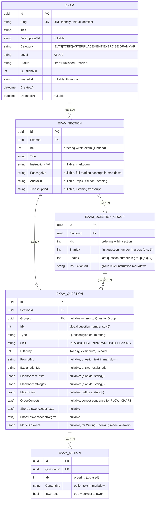

# LANGFENS SYSTEM ARCHITECTURE & STRICT DATA SCHEMA
> **Generated by autonomous codebase reconnaissance — March 5, 2026**
> Sources: `services/exam-service`, `services/attempt-service`, `services/_shared`, `scripts/pipeline_v2/models.py`, `scripts/crawled_jsons/`

---

## 1. EXECUTIVE SUMMARY

### Tech Stack

| Layer | Technology |
|---|---|
| **Backend** | .NET 8 C#, ASP.NET Core, Entity Framework Core 8 |
| **Architecture** | Microservices (exam-service, attempt-service, auth-service, course-service, chatbot-service, dictionary-service) |
| **API Gateway** | Custom gateway at `/gateway/api-gateway` |
| **Database** | PostgreSQL (JSONB columns for answer keys, text[] for arrays) |
| **Message Bus** | (inferred from Events contracts — likely RabbitMQ/MassTransit) |
| **Frontend** | Next.js (App Router) — codebase partially available at `selenis-fe` |
| **AI Grading** | Dedicated writing-service & speaking-service with WritingGradeDto / SpeakingGradeDto |

### High-Level Architecture

```
Client (Next.js)
    │
    ▼
API Gateway
    ├── exam-service      → CRUD for Exams, Sections, QuestionGroups, Questions, Options
    ├── attempt-service   → Start/Autosave/Submit/Grade attempts
    ├── auth-service      → JWT auth, roles (Admin / User)
    ├── writing-service   → AI grading for Writing tasks
    ├── speaking-service  → AI grading for Speaking tasks
    └── course-service    → Courses, lessons, enrollment
```

### Exam Category Constants
```
IELTS | TOEIC | VSTEP | PLACEMENT | EXERCISE | GRAMMAR
```

### Exam Level Constants (CEFR)
```
A1 | A2 | B1 | B2 | C1 | C2
```

### Exam Status Constants
```
Draft (0) | Published (1) | Archived (2)
```

---

## 2. ENTITY RELATIONSHIP DIAGRAM (Mermaid.js)



---

## 3. THE BUSINESS LOGIC RULEBOOK

### 3.1 Question Type → Grader Mapping

| Question Type Constant | Grader Class | Answer Field Used |
|---|---|---|
| `MULTIPLE_CHOICE_SINGLE` | `SingleChoiceGrader` | `SelectedOptionIds[0]` (exactly 1) |
| `MULTIPLE_CHOICE_SINGLE_IMAGE` | `SingleChoiceGrader` | `SelectedOptionIds[0]` |
| `TRUE_FALSE_NOT_GIVEN` | `SingleChoiceGrader` | `SelectedOptionIds[0]` |
| `YES_NO_NOT_GIVEN` | `SingleChoiceGrader` | `SelectedOptionIds[0]` |
| `MULTIPLE_CHOICE_MULTIPLE` | `MultipleChoiceGrader` | `SelectedOptionIds[]` (set equality) |
| `SUMMARY_COMPLETION` | `CompletionGrader` | `TextAnswer` as JSON `{"blankId":"val"}` |
| `TABLE_COMPLETION` | `CompletionGrader` | `TextAnswer` as JSON |
| `NOTE_COMPLETION` | `CompletionGrader` | `TextAnswer` as JSON |
| `FORM_COMPLETION` | `CompletionGrader` | `TextAnswer` as JSON |
| `SENTENCE_COMPLETION` | `CompletionGrader` | `TextAnswer` as JSON |
| `DIAGRAM_LABEL` | `LabelGrader` (→CompletionGrader) | `TextAnswer` as JSON `{"labelNodeId":"val"}` |
| `MAP_LABEL` | `LabelGrader` (→CompletionGrader) | `TextAnswer` as JSON `{"labelNodeId":"val"}` |
| `MATCHING_HEADING` | `MatchingHeadingGrader` | `TextAnswer` as JSON `{"sectionKey":"heading"}` |
| `MATCHING_INFORMATION` | `MatchingHeadingGrader` | `TextAnswer` as JSON `{"info-qN":"paragraphLetter"}` |
| `MATCHING_FEATURES` | `MatchingHeadingGrader` | `TextAnswer` as JSON `{"featureKey":"personName"}` |
| `MATCHING_ENDINGS` | `MatchingHeadingGrader` | `TextAnswer` as JSON `{"sentenceKey":"ending"}` |
| `CLASSIFICATION` | `MatchingHeadingGrader` | `TextAnswer` as JSON `{"itemKey":"category"}` |
| `FLOW_CHART` | `FlowChartGrader` | `TextAnswer` as JSON `["node1","node2","node3"]` |
| `SHORT_ANSWER` | `ShortAnswerGrader` | `TextAnswer` plain string |
| `AUDIO_RESPONSE` | `ShortAnswerGrader` | `TextAnswer` plain string (transcribed) |

### 3.2 Text Normalization (`TextNorm.Normalize`)

All text comparisons go through `TextNorm.Normalize()` which:
1. Trims whitespace
2. Converts to lowercase
3. Applies Unicode NFD decomposition (removes diacritical marks → "café" → "cafe")
4. Collapses multiple spaces to single space

**Example:** `"John Gould"` == `"john gould"` == `"JOHN  GOULD"` ✅

### 3.3 Completion Grader Logic (Fill-in-Blank)

**Payload format (multi-blank):**
```json
{ "blank-q10": "one-sixth", "blank-q11": "16th century" }
```

**Payload format (single-blank legacy):** plain string `"one-sixth"`

**Matching algorithm:**
1. First try `BlankAcceptTexts` (exact after normalization)
2. If no match, try `BlankAcceptRegex` (Regex.IsMatch with `IgnoreCase | CultureInvariant`)
3. Regex is auto-wrapped with `^...$` if not already anchored
4. Score = `(matchedBlanks / totalBlanks) × questionPoints` (partial credit)

### 3.4 Matching Grader Logic

**Payload format:**
```json
{ "info-q1": "I", "info-q2": "F", "info-q3": "G" }
```

DB key: `matchPairs` = `{ "info-q1": ["I"], "info-q2": ["F"] }` (array allows multiple valid answers)

**Matching:** Case-insensitive string equality. Score = `(matched / total) × points`.

### 3.5 FlowChart Grader (FLOW_CHART)

**Payload format:** `["stage-b", "stage-d", "stage-a"]`

Uses **Longest Common Subsequence (LCS)** algorithm — partial credit for correct relative ordering.
Score = `(LCS length / correctLength) × points`

Node normalization: lowercase, replace `-` with space, remove non-alphanumeric, collapse spaces.

### 3.6 Band Score Conversion

**`IeltsBandConverter.FromAcademicReading(correctOutOf40)`** — approximate IELTS Academic conversion:

| Correct (out of 40) | Band |
|---|---|
| 39–40 | 9.0 |
| 37–38 | 8.5 |
| 35–36 | 8.0 |
| 33–34 | 7.5 |
| 30–32 | 7.0 |
| 27–29 | 6.5 |
| 23–26 | 6.0 |
| 19–22 | 5.5 |
| 15–18 | 5.0 |
| 13–14 | 4.5 |
| 10–12 | 4.0 |
| 8–9 | 3.5 |
| 6–7 | 3.0 |
| 4–5 | 2.5 |
| 2–3 | 2.0 |
| 1 | 1.0 |
| 0 | 0.0 |

**For non-40-question tests:** `FromAcademicReadingScaled(correct, total)` scales to 40 first.
**Listening:** Uses same table via `FromAcademicListeningScaled(correct, total)`.

### 3.7 Writing & Speaking Grading

Handled by separate AI services. Results stored as:
```csharp
WritingGradeDto(OverallBand, WordCount,
    TaskResponse, CoherenceAndCohesion,
    LexicalResource, GrammaticalRangeAndAccuracy,
    Suggestions, ImprovedParagraph)

SpeakingGradeDto(OverallBand, Transcription,
    FluencyAndCoherence, LexicalResource,
    GrammaticalRangeAndAccuracy, Pronunciation,
    Suggestions, ImprovedAnswer)
```
Each criterion = `CriterionScoreDto(Band: double, Comment: string)`.

### 3.8 Answer Key Sanitization (Critical Security Rule)

When serving the "paper" JSON to the frontend for a live attempt, `SnapshotSanitizer.Sanitize()` is called which:
- Sets `IsCorrect = null` on all options
- Clears `BlankAcceptTexts`, `BlankAcceptRegex`, `MatchPairs`, `OrderCorrects`, `ShortAnswerAcceptTexts`, `ShortAnswerAcceptRegex`

**Never expose answer keys to the client during active attempts.**

---

## 4. API CONTRACTS

### 4.1 Admin — Create Exam (multi-step process)

**Step 1 — Create Exam shell:**
```
POST /api/exams
```
```json
{
  "title": "IELTS Reading — Australian Parrots",
  "slug": "ielts-reading-australian-parrots",
  "descriptionMd": "Practice test with 13 questions...",
  "category": "IELTS",
  "level": "B2",
  "durationMin": 20,
  "imageUrl": "https://cdn.langfens.com/exams/parrots.jpg"
}
```

**Step 2 — Create Section:**
```
POST /api/exams/{examId}/sections
```
```json
{
  "examId": "<uuid>",
  "idx": 1,
  "title": "Australian Parrots and Their Adaptation",
  "instructionsMd": "# Reading Passage\n\nA. Parrots are found across...",
  "passageMd": null,
  "audioUrl": null,
  "transcriptMd": null
}
```
> **Note:** For Reading, the passage is embedded inside `instructionsMd`. The `passageMd` field is a separate optional field for passages that render distinctly from instructions.

**Step 3 — Create Question Group:**
```
POST /api/sections/{sectionId}/groups
```
```json
{
  "sectionId": "<uuid>",
  "idx": 1,
  "startIdx": 1,
  "endIdx": 6,
  "instructionMd": "## Questions 1–6\n\nThe reading passage has ten paragraphs labeled **A–J**.\nWhich paragraph contains the following information?\n\nWrite the **correct letter A–J** in boxes 1–6."
}
```

**Step 4 — Create Question:**
```
POST /api/questions
```
DTO: `AdminQuestionUpsert`
```json
{
  "sectionId": "<uuid>",
  "idx": 1,
  "type": "MATCHING_INFORMATION",
  "skill": "READING",
  "difficulty": 2,
  "promptMd": "An example of how one parrot species may survive at the expense of another",
  "explanationMd": "The answer is I.",
  "blankAcceptTexts": null,
  "blankAcceptRegex": null,
  "matchPairs": { "info-q1": ["I"] },
  "orderCorrects": null,
  "shortAnswerAcceptTexts": null,
  "shortAnswerAcceptRegex": null
}
```

**Step 5 — Create Options (for MC/TF/YN types only):**
```
POST /api/options
```
```json
{
  "questionId": "<uuid>",
  "idx": 1,
  "contentMd": "Had ancestors in a continent which later split up",
  "isCorrect": true
}
```

### 4.2 Public — Attempt Flow

**Start attempt:**
```
POST /api/attempts/start
{ "examId": "<uuid>" }
→ { "attemptId": "<uuid>", "paper": { sanitized exam JSON }, "startedAt": "...", "durationSec": 1200, "timeLeft": 1200 }
```

**Autosave (PATCH every 30s):**
```
PATCH /api/attempts/{attemptId}/autosave
{
  "answers": [
    { "questionId": "<uuid>", "selectedOptionIds": ["<optionUuid>"], "textAnswer": null },
    { "questionId": "<uuid>", "selectedOptionIds": null, "textAnswer": "{\"blank-q10\":\"one-sixth\"}" }
  ],
  "clientRevision": 1234567890
}
```

**Submit:**
```
POST /api/attempts/{attemptId}/submit
→ { "attemptId": "...", "status": "GRADED", "scoreRaw": 10.0, "scorePct": 76.9, "correct": 10, "total": 13 }
```

**Get results:**
```
GET /api/attempts/{attemptId}/result
→ AttemptResultResponse (full, with IeltsBand, per-skill scores, WritingGrade, SpeakingGrade)
```

### 4.3 Frontend Rendering Payload (Public Exam Detail)

```json
{
  "id": "<uuid>",
  "slug": "ielts-reading-australian-parrots",
  "title": "IELTS Reading — Australian Parrots",
  "descriptionMd": "...",
  "category": "IELTS",
  "level": "B2",
  "durationMin": 20,
  "imageUrl": "https://...",
  "sections": [
    {
      "idx": 1,
      "title": "Australian Parrots...",
      "instructionMd": "# Reading Passage\n\nA. Parrots are...",
      "passageMd": null,
      "audioUrl": null,
      "transcriptMd": null,
      "questionGroups": [
        {
          "id": "<uuid>",
          "idx": 1,
          "startIdx": 1,
          "endIdx": 6,
          "instructionMd": "## Questions 1–6\n\n...",
          "questions": [ ... ]
        }
      ],
      "questions": [
        {
          "idx": 1,
          "type": "MATCHING_INFORMATION",
          "skill": "READING",
          "difficulty": 2,
          "promptMd": "An example of how one parrot...",
          "options": []
        }
      ]
    }
  ]
}
```
> ⚠️ Answer keys (`isCorrect`, `blankAcceptTexts`, `matchPairs`, etc.) are **stripped** from this payload by `SnapshotSanitizer`.

---

## 5. THE "HOLY GRAIL" JSON SCHEMA

### 5.1 Complete Reading Test (real-world example — matches backend DTOs)

```json
{
  "exams": [
    {
      "id": "ec95f0a9-952e-425a-83d4-5c2c22f958cc",
      "slug": "ielts-reading-australian-parrots-and-their-adaptation-to-habitat-change",
      "title": "IELTS Reading - Australian parrots and their adaptation to habitat change",
      "descriptionMd": "IELTS Reading practice test: Australian parrots. 13 questions.",
      "category": "IELTS",
      "level": "B2",
      "status": "PUBLISHED",
      "durationMin": 20,
      "sections": [
        {
          "id": "08902d29-64b3-4e93-b6c5-e92ac384147e",
          "idx": 1,
          "title": "Australian parrots and their adaptation to habitat change",
          "instructionsMd": "# Reading Passage\n\nA. Parrots are found across the tropic...\n\n[full passage embedded here as markdown with **bold** paragraph markers A–J]\n\nThere are 345 varieties of parrot in existence and, of these, 10 **______** live in Australia.",
          "passageMd": null,
          "audioUrl": null,
          "transcriptMd": null,
          "questionGroups": [
            {
              "id": "grp-001",
              "idx": 1,
              "startIdx": 1,
              "endIdx": 6,
              "instructionMd": "## Questions 1–6\n\nThe reading passage has ten paragraphs **A–J**.\nWhich paragraph contains the following information?\nWrite the correct letter **A–J** in boxes 1–6 on your answer sheet.",
              "questions": []
            },
            {
              "id": "grp-002",
              "idx": 2,
              "startIdx": 7,
              "endIdx": 9,
              "instructionMd": "## Questions 7–9\n\nChoose the correct letter **A, B, C or D**.",
              "questions": []
            },
            {
              "id": "grp-003",
              "idx": 3,
              "startIdx": 10,
              "endIdx": 13,
              "instructionMd": "## Questions 10–13\n\nComplete the summary below. Choose **NO MORE THAN TWO WORDS** from the passage.",
              "questions": []
            }
          ],
          "questions": [
            {
              "id": "bd9aa6b8-9385-42f9-b741-954bc4111d68",
              "idx": 1,
              "type": "MATCHING_INFORMATION",
              "skill": "READING",
              "difficulty": 2,
              "promptMd": "An example of how one parrot species may survive at the expense of another",
              "explanationMd": "The answer is I. (paragraph I discusses galahs displacing black cockatoos)",
              "options": [],
              "flowChartNodes": null,
              "blankAcceptTexts": null,
              "blankAcceptRegex": null,
              "matchPairs": { "info-q1": ["I"] },
              "orderCorrects": null,
              "shortAnswerAcceptTexts": null,
              "shortAnswerAcceptRegex": null
            },
            {
              "id": "c7af6391-9377-4032-99fc-467153a9dd74",
              "idx": 7,
              "type": "MULTIPLE_CHOICE_SINGLE",
              "skill": "READING",
              "difficulty": 2,
              "promptMd": "The writer believes that most parrot species",
              "explanationMd": "The answer is C.",
              "options": [
                { "id": "opt-1", "idx": 1, "contentMd": "Move from Africa and South America to Australia", "isCorrect": false },
                { "id": "opt-2", "idx": 2, "contentMd": "Had ancestors in either Africa, Australia or South America", "isCorrect": false },
                { "id": "opt-3", "idx": 3, "contentMd": "Had ancestors in a continent which later split up", "isCorrect": true },
                { "id": "opt-4", "idx": 4, "contentMd": "Came from a continent now covered by water", "isCorrect": false }
              ],
              "flowChartNodes": null,
              "blankAcceptTexts": null,
              "blankAcceptRegex": null,
              "matchPairs": null,
              "orderCorrects": null,
              "shortAnswerAcceptTexts": null,
              "shortAnswerAcceptRegex": null
            },
            {
              "id": "23480c17-d51e-41b6-bf80-d66d6bcb34fe",
              "idx": 10,
              "type": "SUMMARY_COMPLETION",
              "skill": "READING",
              "difficulty": 2,
              "promptMd": "Complete the summary. Write **ONE OR TWO WORDS**.\n\n10. There are 345 varieties of parrot in existence and, of these, **______** live in Australia.",
              "explanationMd": "The answer is: one-sixth",
              "options": [],
              "flowChartNodes": null,
              "blankAcceptTexts": { "blank-q10": ["one-sixth", "One-Sixth"] },
              "blankAcceptRegex": null,
              "matchPairs": null,
              "orderCorrects": null,
              "shortAnswerAcceptTexts": null,
              "shortAnswerAcceptRegex": null
            }
          ]
        }
      ]
    }
  ]
}
```

### 5.2 Complete Listening Test

```json
{
  "id": "<uuid>",
  "slug": "ielts-listening-dolphin-conservation-trust",
  "title": "IELTS Listening - Dolphin Conservation Trust",
  "category": "IELTS",
  "level": "B2",
  "status": "PUBLISHED",
  "durationMin": 30,
  "sections": [
    {
      "idx": 1,
      "title": "Part 1: Dolphin Conservation Trust",
      "instructionsMd": "## Section 1\n\nComplete the form below. Write **ONE WORD AND/OR A NUMBER** for each answer.",
      "passageMd": null,
      "audioUrl": "https://cdn.langfens.com/audio/dolphin-conservation.mp3",
      "transcriptMd": "**Transcript:**\n\nSally: Good morning, Dolphin Conservation Trust...",
      "questionGroups": [
        {
          "id": "<uuid>",
          "idx": 1,
          "startIdx": 1,
          "endIdx": 5,
          "instructionMd": "## Questions 1–5\n\nComplete the form. Write **ONE WORD AND/OR A NUMBER**.\n\n| Field | Answer |\n|---|---|\n| Name | Mrs **______** (Q1) |\n| Membership type | **______** (Q2) |\n| Amount donated | £ **______** (Q3) |\n| Newsletter format | **______** (Q4) |\n| Special interest | **______** (Q5) |",
          "questions": []
        }
      ],
      "questions": [
        {
          "id": "<uuid>",
          "idx": 1,
          "type": "FORM_COMPLETION",
          "skill": "LISTENING",
          "difficulty": 1,
          "promptMd": "Name: Mrs **______**",
          "explanationMd": "The caller gives her name as Mrs Paulson.",
          "options": [],
          "blankAcceptTexts": { "blank-q1": ["Paulson", "paulson"] },
          "blankAcceptRegex": { "blank-q1": ["paulson"] },
          "matchPairs": null,
          "orderCorrects": null,
          "shortAnswerAcceptTexts": null,
          "shortAnswerAcceptRegex": null
        }
      ]
    }
  ]
}
```

---

## 6. ALL QUESTION TYPE JSON SNIPPETS

### 6.1 `MULTIPLE_CHOICE_SINGLE` / `TRUE_FALSE_NOT_GIVEN` / `YES_NO_NOT_GIVEN`

```json
{
  "idx": 7,
  "type": "MULTIPLE_CHOICE_SINGLE",
  "skill": "READING",
  "difficulty": 2,
  "promptMd": "The writer believes most parrot species",
  "explanationMd": "Answer: C",
  "options": [
    { "idx": 1, "contentMd": "Option A text", "isCorrect": false },
    { "idx": 2, "contentMd": "Option B text", "isCorrect": false },
    { "idx": 3, "contentMd": "Option C text — CORRECT", "isCorrect": true },
    { "idx": 4, "contentMd": "Option D text", "isCorrect": false }
  ],
  "blankAcceptTexts": null, "blankAcceptRegex": null,
  "matchPairs": null, "orderCorrects": null,
  "shortAnswerAcceptTexts": null, "shortAnswerAcceptRegex": null
}
```
> **TF/YN:** options must be exactly `["True","False","Not Given"]` or `["Yes","No","Not Given"]` with one marked `isCorrect: true`.

### 6.2 `MULTIPLE_CHOICE_MULTIPLE` ("Choose TWO letters A–E")

```json
{
  "idx": 14,
  "type": "MULTIPLE_CHOICE_MULTIPLE",
  "skill": "READING",
  "difficulty": 3,
  "promptMd": "Which TWO of the following are mentioned as problems with solar panels?",
  "options": [
    { "idx": 1, "contentMd": "A — High initial cost", "isCorrect": true },
    { "idx": 2, "contentMd": "B — Difficult to recycle", "isCorrect": false },
    { "idx": 3, "contentMd": "C — Dependence on weather", "isCorrect": true },
    { "idx": 4, "contentMd": "D — Require large space", "isCorrect": false },
    { "idx": 5, "contentMd": "E — Low energy efficiency", "isCorrect": false }
  ],
  "blankAcceptTexts": null, "blankAcceptRegex": null,
  "matchPairs": null, "orderCorrects": null,
  "shortAnswerAcceptTexts": null, "shortAnswerAcceptRegex": null
}
```
> **Grading:** full points only if `SelectedOptionIds` set exactly equals correct option IDs set (both A and C, no more, no less).

### 6.3 `SUMMARY_COMPLETION` / `NOTE_COMPLETION` / `TABLE_COMPLETION` / `SENTENCE_COMPLETION` / `FORM_COMPLETION`

```json
{
  "idx": 10,
  "type": "SUMMARY_COMPLETION",
  "skill": "READING",
  "difficulty": 2,
  "promptMd": "Complete the summary. Write **ONE OR TWO WORDS**.\n\nThere are 345 varieties of parrot and **______** (Q10) live in Australia. As early as the **______** (Q11), mapmaker **______** (Q12) named the area Terra Psittacorum.",
  "explanationMd": "Q10: one-sixth | Q11: 16th century | Q12: Mercator",
  "options": [],
  "blankAcceptTexts": {
    "blank-q10": ["one-sixth", "One-Sixth"],
    "blank-q11": ["16th century", "16Th Century", "sixteenth century"],
    "blank-q12": ["Mercator", "mercator"]
  },
  "blankAcceptRegex": {
    "blank-q11": ["16th\\s+century", "sixteenth\\s+century"]
  },
  "matchPairs": null, "orderCorrects": null,
  "shortAnswerAcceptTexts": null, "shortAnswerAcceptRegex": null
}
```
> **Blank ID convention:** `"blank-q{idx}"` (e.g., `blank-q10`, `blank-q11`).
> **Client payload:** `TextAnswer = "{\"blank-q10\":\"one-sixth\",\"blank-q11\":\"16th century\",\"blank-q12\":\"Mercator\"}"`

### 6.4 `MATCHING_INFORMATION` / `MATCHING_FEATURES` / `MATCHING_ENDINGS` / `CLASSIFICATION`

```json
{
  "idx": 1,
  "type": "MATCHING_INFORMATION",
  "skill": "READING",
  "difficulty": 2,
  "promptMd": "An example of how one parrot species may survive at the expense of another",
  "explanationMd": "The answer is I.",
  "options": [],
  "blankAcceptTexts": null, "blankAcceptRegex": null,
  "matchPairs": { "info-q1": ["I"] },
  "orderCorrects": null,
  "shortAnswerAcceptTexts": null, "shortAnswerAcceptRegex": null
}
```
> **Match key convention:** `"info-q{idx}"` for MATCHING_INFORMATION.
> **Multiple valid answers:** `"info-q1": ["I", "J"]` — either accepted.
> **Client payload:** `TextAnswer = "{\"info-q1\":\"I\",\"info-q2\":\"F\",\"info-q3\":\"G\"}"`

### 6.5 `MATCHING_HEADING`

```json
{
  "idx": 8,
  "type": "MATCHING_HEADING",
  "skill": "READING",
  "difficulty": 3,
  "promptMd": "**Section B** — The origins of parrots",
  "explanationMd": "Answer: vi",
  "options": [
    { "idx": 1, "contentMd": "**i** — The impact of human settlement", "isCorrect": false },
    { "idx": 2, "contentMd": "**ii** — Differences in beak design", "isCorrect": false },
    { "idx": 3, "contentMd": "**iii** — A continent of rich diversity", "isCorrect": false },
    { "idx": 4, "contentMd": "**iv** — Ancient origins of birds", "isCorrect": false },
    { "idx": 5, "contentMd": "**v** — Cooperation between species", "isCorrect": false },
    { "idx": 6, "contentMd": "**vi** — Ancient continent of origin", "isCorrect": false },
    { "idx": 7, "contentMd": "**vii** — Adaptation to climate change", "isCorrect": false }
  ],
  "blankAcceptTexts": null, "blankAcceptRegex": null,
  "matchPairs": { "section-B": ["vi"] },
  "orderCorrects": null,
  "shortAnswerAcceptTexts": null, "shortAnswerAcceptRegex": null
}
```
> **Note:** `options` list provides the heading bank for UI rendering but `IsCorrect` is NOT set on options — the answer lives in `matchPairs`.
> **Match key convention:** `"section-{letter}"` (e.g., `section-B`, `section-C`).
> **Client payload:** `TextAnswer = "{\"section-B\":\"vi\",\"section-C\":\"iii\"}"`

### 6.6 `DIAGRAM_LABEL` / `MAP_LABEL`

```json
{
  "idx": 21,
  "type": "MAP_LABEL",
  "skill": "LISTENING",
  "difficulty": 2,
  "promptMd": "Label the map. Write the **letter (A–H)** next to each label.\n\n\n\n21. Post Office = **______**\n22. Car Park = **______**",
  "explanationMd": "21: E | 22: C",
  "options": [],
  "blankAcceptTexts": null, "blankAcceptRegex": null,
  "matchPairs": null, "orderCorrects": null,
  "shortAnswerAcceptTexts": null, "shortAnswerAcceptRegex": null
}
```
> **Note:** Uses `LabelGrader` (delegates to `CompletionGrader`).
> **Blank key convention:** `"label-node-21"`, `"label-node-22"` OR node keys that match the diagram SVG.
> **Client payload:** `TextAnswer = "{\"label-node-21\":\"E\",\"label-node-22\":\"C\"}"`

### 6.7 `SHORT_ANSWER`

```json
{
  "idx": 35,
  "type": "SHORT_ANSWER",
  "skill": "READING",
  "difficulty": 2,
  "promptMd": "Write **NO MORE THAN THREE WORDS** from the passage.\n\nWhat substance are parrot beaks made from?",
  "explanationMd": "The answer is: keratin",
  "options": [],
  "blankAcceptTexts": null, "blankAcceptRegex": null,
  "matchPairs": null, "orderCorrects": null,
  "shortAnswerAcceptTexts": ["keratin"],
  "shortAnswerAcceptRegex": ["keratin"]
}
```
> **Client payload:** `TextAnswer = "keratin"` (plain string, not JSON).

### 6.8 `FLOW_CHART`

```json
{
  "idx": 28,
  "type": "FLOW_CHART",
  "skill": "LISTENING",
  "difficulty": 3,
  "promptMd": "Complete the flow chart. Drag the stages into the correct order.\n\n**Stage A** → ? → **Stage C** → ? → **Stage E**",
  "explanationMd": "Correct order: A → B → C → D → E",
  "options": [],
  "blankAcceptTexts": null, "blankAcceptRegex": null,
  "matchPairs": null,
  "orderCorrects": ["stage-a", "stage-b", "stage-c", "stage-d", "stage-e"],
  "shortAnswerAcceptTexts": null, "shortAnswerAcceptRegex": null
}
```
> **Client payload:** `TextAnswer = "[\"stage-a\",\"stage-b\",\"stage-c\",\"stage-d\",\"stage-e\"]"`
> **Scoring:** LCS-based partial credit.

---

## 7. SCRAPING STRATEGY FOR LANGFENS DATA PIPELINE

Based on the above analysis, scraped data **MUST** be mapped to this exact schema. Key rules:

### 7.1 Field Mapping Summary

| Scraped field | Langfens JSON field | Notes |
|---|---|---|
| Passage text | `sections[].instructionsMd` | Embed as markdown with paragraph markers **A**, **B**, **C**... |
| Section/Part title | `sections[].title` | e.g., "Part 1: Dolphin Conservation" |
| Audio file URL | `sections[].audioUrl` | Absolute URL to .mp3 |
| Listening transcript | `sections[].transcriptMd` | Full transcript as markdown |
| Question group header | `questionGroups[].instructionMd` | e.g., "Questions 1–5: Complete the form" |
| Question number | `questions[].idx` | Global 1-based integer |
| Question text | `questions[].promptMd` | Markdown; blanks as `**______**` |
| Answer explanation | `questions[].explanationMd` | "The answer is X" |
| MC options | `questions[].options[]` | `isCorrect: true/false` |
| Fill-blank answers | `questions[].blankAcceptTexts` | `{"blank-q{idx}": ["ans1","ans2"]}` |
| Regex answers | `questions[].blankAcceptRegex` | `{"blank-q{idx}": ["pattern"]}` |
| Matching pairs | `questions[].matchPairs` | `{"info-q{idx}": ["letter"]}` |

### 7.2 Question Type Detection Heuristics

| Scraped pattern | Assign type |
|---|---|
| "Choose ONE letter A/B/C/D" | `MULTIPLE_CHOICE_SINGLE` |
| "Choose TWO/THREE letters" | `MULTIPLE_CHOICE_MULTIPLE` |
| "TRUE / FALSE / NOT GIVEN" | `TRUE_FALSE_NOT_GIVEN` |
| "YES / NO / NOT GIVEN" | `YES_NO_NOT_GIVEN` |
| "Complete the summary/notes/table/form/sentence" + blanks | `SUMMARY_COMPLETION` / `NOTE_COMPLETION` / `TABLE_COMPLETION` / `FORM_COMPLETION` / `SENTENCE_COMPLETION` |
| "Which paragraph contains" | `MATCHING_INFORMATION` |
| "Match each paragraph to a heading" | `MATCHING_HEADING` |
| "Match each [person/feature]" | `MATCHING_FEATURES` |
| "Match sentence beginnings with endings" | `MATCHING_ENDINGS` |
| "Classify the following" | `CLASSIFICATION` |
| "Label the diagram/map" | `DIAGRAM_LABEL` / `MAP_LABEL` |
| Flow diagram with arrows | `FLOW_CHART` |
| "Write NO MORE THAN N WORDS" (single answer) | `SHORT_ANSWER` |

---

## 8. CRITICAL DATA CONSTRAINTS (DO NOT VIOLATE)

1. **`slug` must be globally unique** and match `^[a-z0-9-]+$`
2. **`Idx` is 1-based** for all entities (sections, questions, options, groups)
3. **`blankAcceptTexts` key = `"blank-q{question_idx}"`** — must match exactly what the frontend sends
4. **`matchPairs` key conventions:**
   - `MATCHING_INFORMATION` → `"info-q{idx}"`
   - `MATCHING_HEADING` → `"section-{LETTER}"`
   - `MATCHING_FEATURES` / `MATCHING_ENDINGS` → `"{left_item_key}"`
5. **Options are ONLY populated for:** `MULTIPLE_CHOICE_SINGLE`, `MULTIPLE_CHOICE_MULTIPLE`, `TRUE_FALSE_NOT_GIVEN`, `YES_NO_NOT_GIVEN`, `MULTIPLE_CHOICE_SINGLE_IMAGE`, and the heading bank for `MATCHING_HEADING`
6. **`isCorrect` is NOT set on options for `MATCHING_HEADING`** — answer lives in `matchPairs`
7. **Answer keys are stripped before delivery to client** via `SnapshotSanitizer`
8. **Writing/Speaking questions** do NOT have auto-grading — they go to AI service; store model answers in `ModelAnswers: string[]`
9. **`BlankAcceptTexts` supports multiple valid answers per blank** — always provide case variants
10. **`BlankAcceptRegex` patterns** are auto-anchored with `^...$` if not already anchored; use `RegexOptions.IgnoreCase`

---

*Document generated from: `services/exam-service/`, `services/attempt-service/`, `services/_shared/`, `scripts/pipeline_v2/models.py`, `scripts/crawled_jsons/australian-parrots.json`*
