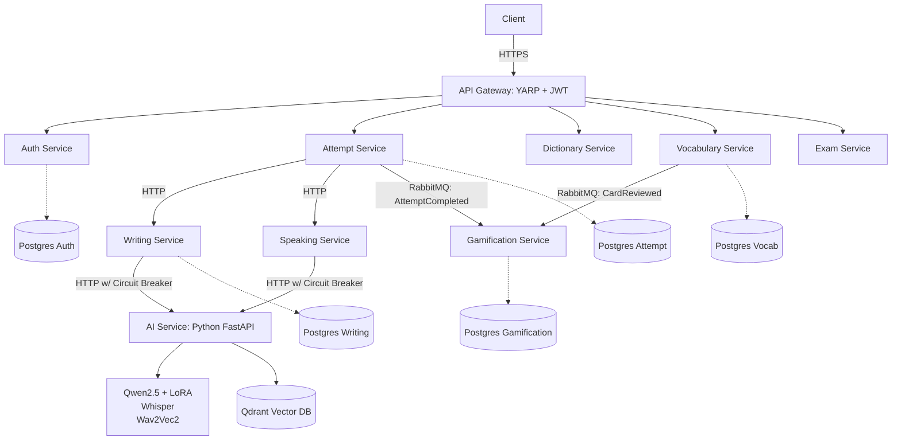

# Langfens

> **An AI-powered IELTS preparation platform that solves the high cost of manual grading and poor vocabulary retention using specialized AI pipelines, event-driven microservices, and spaced repetition.**

<p align="center">
  
  
  
  
  
  
  
  
  
</p>


## Overview

Traditional IELTS preparation suffers from expensive and delayed manual grading, unrealistic practice environments, and low vocabulary retention. Targeting students and English centers, Langfens reduces grading costs by 80% while providing instant, high-quality feedback. It addresses these bottlenecks by providing a unified, production-oriented ecosystem:

- **Instant, granular AI grading** for Writing and Speaking (via fine-tuned local LLMs and acoustic models).
- **Event-driven gamification** and **SM2-based spaced repetition**.
- A **scalable microservices architecture** (.NET 10 + Python) leveraging asynchronous message queues and independent data stores.

## Key Capabilities

### AI & Machine Learning
- **Local LoRA Inference**: Uses a dynamically loaded LoRA adapter on Qwen2.5 (`peft` via HuggingFace) for IELTS-specific scoring.
- **Criterion-Based RAG Pipeline**: Retrieves high-scoring reference essays from a Qdrant vector database (using `bge-m3` embeddings) based on the specific grading criterion being evaluated, drastically reducing LLM hallucination.
- **Acoustic & STT Pipeline**: Combines `faster-whisper` for speech-to-text with a custom `Wav2Vec2`-based acoustic model (`PronunciationScorerModel` in PyTorch) for precise fluency and pronunciation scoring.
- **Model Orchestration**: Intelligently routes between local inference (Qwen/Ollama) and external APIs (Groq) with fallback mechanisms.

### Engineering & Architecture
- **Distributed Microservices**: 11 distinct services (10 ASP.NET Core, 1 FastAPI Python) mapped via YARP Reverse Proxy.
- **Event-Driven Workflows**: RabbitMQ (via MassTransit) decouples heavy AI inference and gamification from synchronous user request paths.
- **Domain-Driven Data**: 10 isolated PostgreSQL databases enforce strict boundaries. `pg_trgm` GIN indexes handle rapid dictionary lookups without needing external search engines.
- **Resilience**: Implements Circuit Breaker patterns for AI HTTP clients and isolated worker scaling.

## System Architecture



*Note: The API Gateway (YARP) validates JWTs before routing traffic. The Frontend acquires tokens from Auth Service, but all protected endpoints rely on the Gateway's strict validation.*

## AI Pipeline: End-to-End Writing Grading

Langfens avoids generic "black box" LLM prompts by using a deeply orchestrated, criterion-specific retrieval pipeline.

```mermaid
sequenceDiagram
    participant U as User
    participant G as API Gateway
    participant W as Writing Service
    participant MQ as RabbitMQ
    participant AI as AI Service (Python)
    participant Q as Qdrant DB
    participant LLM as Qwen2.5-LoRA
    participant A as Attempt Service
    participant XP as Gamification

    U->>G: POST /api/writing/grade
    G->>W: Validate Token & Route
    W->>MQ: Publish WritingSubmitted
    W-->>U: Return 202 Accepted (Pending)
    
    MQ->>W: Consume WritingSubmitted (Async Worker)
    W->>AI: HTTP POST /grade (Circuit Breaker)
    
    rect rgb(30, 41, 59)
    note right of AI: AI Pipeline Execution
    AI->>AI: Extract Heuristics (Word Count, Errors)
    AI->>Q: Embed & Retrieve Reference Essays (RAG)
    Q-->>AI: High-Scoring Context
    AI->>LLM: Prompt (Essay + Context + Rubric)
    LLM-->>AI: Raw JSON Output
    AI->>AI: Pydantic Validation & Parse
    end
    
    AI-->>W: Return Structured JSON Feedback
    W->>MQ: Publish WritingGraded Event
    
    MQ->>A: Consume (Persist Scores)
    A->>MQ: Publish AttemptCompleted Event
    MQ->>XP: Consume (Award XP)
    
    U->>G: GET /api/writing/history
    G->>W: Retrieve Results
    W-->>U: Detailed 0-9 Band Scores + Feedback
```



1. **Submission**: User submits text. `writing-service` receives the payload and pushes an event to RabbitMQ.
2. **Pre-processing**: Python `ai-service` receives the request. It parses the essay and calculates raw heuristic metrics (word count, grammar error density).
3. **Retrieval (RAG)**: For each IELTS criterion (Task Response, Coherence, Lexical Resource, Grammar):
   - The essay is embedded using `bge-m3`.
   - Qdrant retrieves historically high-scoring essays that match the exact task and criterion.
4. **Inference**: The Qwen2.5-LoRA model is prompted with the raw text, heuristics, and the retrieved contextual examples.
5. **Post-processing**: Granular scores (0-9 bands) and JSON feedback are validated via Pydantic output parsers.
6. **Publish**: `writing-service` receives the HTTP response and publishes a `WritingGraded` event.
7. **Resolution**: `attempt-service` consumes the event, persists the score, and publishes an `AttemptCompleted` event. `gamification-service` consumes this to grant XP.

## Data Flow & API Examples

### Example: Submit a Writing Essay
*The API Gateway validates the Bearer token and routes this request to the `.NET` Writing Service.*

```bash
# 1. Obtain JWT Token via Auth Service
# POST /api/auth/login -> returns { "token": "eyJhbG..." }

# 2. Submit Writing Essay
curl -X POST http://localhost:5000/api/writing/grade \
  -H "Authorization: Bearer eyJhbG..." \
  -H "Content-Type: application/json" \
  -d '{
    "examId": "3fa85f64-5717-4562-b3fc-2c963f66afa6",
    "answer": "The chart illustrates the changes in...",
    "timeSpentSeconds": 1200
  }'
```

### `POST /api/v1/speaking/grade` (Internal Python AI Service)
**Input Flow**: Accepts raw transcripts and heuristic word counts.
**Output Flow**: Returns a deeply structured JSON schema explicitly enforcing IELTS criteria.

```json
{
  "ob": 6.5,
  "fc": { "b": 6.0, "c": "Frequent hesitation detected." },
  "lr": { "b": 7.0, "c": "Good use of idiomatic language." },
  "gr": { "b": 6.5, "c": "Some structural errors in complex sentences." },
  "pr": { "b": 6.5, "c": "Acoustic model detected mispronunciation in 'infrastructure'." },
  "s": ["Practice complex dependent clauses.", "Focus on pacing."],
  "p": "Improved version of the user's transcript...",
  "raw_llm_json": "{...}"
}
```
*This compact JSON payload is mapped back into strict C# Data Transfer Objects via `AiSpeakingGrader.cs`.*

## Core Technical Decisions

### Why Independent PostgreSQL Databases?
To enforce Domain-Driven Design (DDD). Services like `vocabulary-service` and `writing-service` do not share schemas. This prevents tightly coupled queries and allows each service to scale or be migrated independently. `dictionary-service` relies on Postgres `pg_trgm` extensions, whereas `attempt-service` relies on relational normalization.

### Why MassTransit + RabbitMQ?
Grading an IELTS essay or analyzing speech audio takes significant compute time (often 10–40 seconds). Synchronous HTTP would block the .NET thread pool and lead to terrible UX. RabbitMQ allows services to publish events (`WritingSubmitted`, `AttemptCompleted`) and process tasks asynchronously, guaranteeing delivery even during AI service restarts.

### Why Python for the AI Service?
While .NET is excellent for the core API and orchestration, the AI ecosystem (PyTorch, transformers, PEFT for LoRA, faster-whisper) is inherently Python-native. Isolating AI logic in a FastAPI service provides the best of both worlds.

## Project Structure (Mono-Repo)

```text
Project_Langfens_Microservice/
├── AppHost/                   # .NET Aspire local orchestrator (Zero-config dev)
├── deploy/                    # Docker Compose, environment configurations
├── gateway/api-gateway/       # YARP Reverse Proxy handling JWT Auth
├── services/
│   ├── ai-service/            # Python 3.12, FastAPI, Qdrant, LoRA adapters, Whisper
│   ├── attempt-service/       # .NET 10, Auto-graders, MassTransit Consumers
│   ├── auth-service/          # .NET 10, Identity, Redis OTP
│   ├── dictionary-service/    # .NET 10, PostgreSQL pg_trgm fuzzy text search
│   ├── gamification-service/  # .NET 10, XP/Achievements event consumer
│   ├── speaking-service/      # .NET 10, Cloudinary STT orchestration
│   ├── vocabulary-service/    # .NET 10, SM2 Spaced Repetition Algorithm
│   ├── writing-service/       # .NET 10, AI Pipeline HttpClient w/ Circuit Breaker
│   └── _shared/               # Core NuGet libraries, Grpc definitions, Contracts
```

## Running Locally

**Prerequisites:** Docker Desktop and .NET 10 SDK.

The project uses **.NET Aspire** to orchestrate 20+ containers effortlessly in development.

1. **Clone & Configure:**
   ```bash
   git clone <repo-url>
   cd Project_Langfens_Microservice
   cp deploy/envs/*.env .env # Add necessary secrets or placeholders
   ```

2. **Run via AppHost:**
   ```bash
   dotnet run --project AppHost/AppHost.csproj
   ```
   *Aspire automatically pulls required models (like `bge-m3` into Ollama), starts 10 Postgres databases on unique host ports, boots Redis, RabbitMQ, and Qdrant, and wires up connection strings dynamically.*

3. **Access:**
   - Gateway API: `http://localhost:5000`
   - Aspire Telemetry Dashboard: `http://localhost:18888`

## Deployment

Production infrastructure is managed via Docker Compose (`deploy/compose.yaml`). It defines explicit health checks, persistent volumes for databases, models, and message queues, and pins memory limits (e.g., Redis `maxmemory-policy`). Reverse proxy and SSL termination can be layered over the Gateway container.

## Limitations

- **Hardware Dependency**: The `ai-service` running LoRA models and `faster-whisper` requires significant RAM/VRAM. Without a GPU, inference gracefully falls back to CPU but latency increases from ~5s to ~45s.
- **Experimental Acoustic Scoring**: The `Wav2Vec2` pronunciation scorer is experimental and occasionally overly strict on non-native accents.
- **External AI Fallback**: If the local Qwen LoRA adapter fails to load or OOMs, the system currently defaults to external Groq endpoints, incurring a network dependency.

## Why This Project Matters

- **Engineered an Asynchronous AI Pipeline**: Solved long-running LLM inference bottlenecks by decoupling .NET API requests via RabbitMQ and MassTransit.
- **Built a Multi-Modal RAG System**: Integrated Qdrant and Pydantic to ensure the LLM grades based on retrieved real-world reference essays, eliminating generic "hallucinated" feedback.
- **Production-Oriented Microservices**: Managed 11 distinct services and 10 separate databases without sacrificing data integrity, utilizing .NET Aspire and Docker Compose.
- **Model Fine-Tuning Integration**: Successfully deployed a custom LoRA adapter natively within a FastAPI inference server using `peft` and PyTorch.


---
*A solo engineering project by Khoa.*