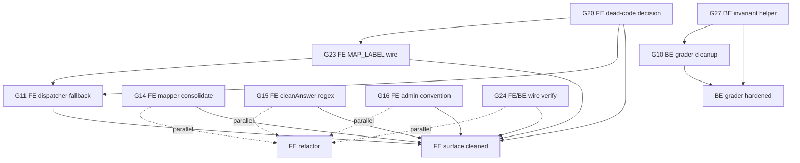

# Sprint 3 — Grader + FE Cleanup

**Duration**: 3–5 working days (1 dev, mostly parallelizable)
**Goal**: Harden BE grader invariants (0/full score, exact-match sequence, feedback strings) + clean up FE dispatcher/mapper/placeholder conventions + reduce dead-code surface.
**Exit criteria**:
1. `MatchingHeadingGrader` + `FlowChartGrader` (BE) return correct feedback + SequenceEqual exact-match rule per spec §11.11 (G10).
2. `CompletionGrader` + `MatchingHeadingGrader` enforce `AwardedPoints ∈ {0, QuestionPoints}` invariant via shared `ScoreFor` helper (G27).
3. `MAP_LABEL` + `DIAGRAM_LABEL` + `MULTIPLE_CHOICE_SINGLE_IMAGE` wire đúng card (MapLabelCard / DiagramLabelCard / MultiChoiceImageCard) — không còn dead-code (G11 + G20 + G23).
4. `MapLabelCard`, `MultiChoiceImageCard`, `TableCompletionCard` được giải quyết (wire hoặc delete) (G20).
5. Legacy `mapApiQuestionToUi.ts` được consolidate sang shared `deriveUiKind` helper (G14).
6. `QuestionPanel.cleanAnswer` regex tightened — không strip arbitrary `Word:` prefix (G15).
7. Admin schema examples dùng `___` placeholder đồng nhất với FE runtime convention (G16).
8. TFNG/YNNG/CLASSIFICATION wire path verified GUID-based + comments pin canonical contract (G24).
9. `dotnet build` (attempt-service, attempt-service.Tests) passes; `npx tsc --noEmit`, `npm run lint`, `npm run build` trên FE pass; smoke-test Reading + Listening attempt đầy đủ (all 19 types) không regression.

## Gap summary

| Gap | Title | Effort | Risk | Depends on |
|---|---|---|---|---|
| G27 | Partial-credit IsCorrect invariant helper | 0.5 h | Low | none |
| G10 | Grader cleanup (MatchingHeading feedback + FlowChart LCS→SequenceEqual) | 1–2 h | Low | G27 (cùng file Grader.cs) |
| G16 | Admin `[1]/[2]` → `___` convention | 0.5 h | Low | none |
| G20 | Dead-code FE card components (MapLabel + MultiChoiceImage + TableCompletion) | 2–4 h | Medium | none |
| G23 | MAP_LABEL wire MapLabelCard (multi-input JSON-map) | 2–3 h | Medium | G20 (MapLabelCard keep) |
| G24 | TFNG/YNNG/CLASSIFICATION wire GUID verify + comments | 1 h | Low | none |
| G15 | `cleanAnswer` prefix-stripping regex tighten | 1–2 h | Medium | none |
| G11 | FE dispatcher fallback stub cho unknown types | 2–3 h | Low | G20/G23 (wire đầy đủ → fallback chỉ là future-proofing) |
| G14 | Consolidate `mapApiQuestionToUi` legacy → shared `deriveUiKind` | 3–4 h | Medium | none (cleanup độc lập) |
| S31 | Click-to-Add Blank UX (admin authoring atomic insert) | 3–4 h | Low | none |

Tổng effort ước tính: **13–20 hours** (1 dev, parallel-friendly trong 3–5 ngày làm việc).

## Execution order

Recommendation: BE gaps trước (zero/FE coupling), FE cleanup sau (chờ seed policy settle). Nhưng cả 2 luồng có thể parallel nếu 2 dev.

```
Day 1 (parallel — independent startup)
├── G27  (BE — 0.5h, fastest, ship first) ← foundational invariant helper
├── G10  (BE — 1.5h, ship after G27 if same dev) ← graders reuse ScoreFor
├── G16  (FE admin editor convention, 0.5h, ship alone)
└── G24  (FE/BE wire verify, 1h, ship alone)

Day 2-3 (parallel after G20 ships)
├── G20  (FE — 2-4h, decide wire/delete per file) ← unblocks G23, G11
├── G15  (FE — 1-2h, regex tighten, independent)
└── G14  (FE — 3-4h, mapper consolidation, independent)

Day 4-5 (sequential after G20)
├── G23  (FE — 2-3h, wire MapLabelCard + DiagramLabelCard) ← requires G20 keep MapLabelCard
└── G11  (FE — 2-3h, dispatcher audit + fallback stub) ← after G23 wires done
```

**Critical sequence**:
- G27 → G10 (G10 may want `ScoreFor` from G27 for consistency, optional).
- G20 (decision: MapLabelCard keep) → G23 (wire MapLabelCard).
- G23 + G20 + G11 all touch `QuestionComponentRegistry.tsx`. Run G23 + G20 in same dev branch, G11 last.

Mermaid:



## Cross-gap risks

1. **G11 + G20 + G23 đều touch `QuestionComponentRegistry.tsx`** — concurrent edits có thể conflict. RECOMMENDATION:
   - Sequence: G20 (commit 1: wire MultiChoiceImage + commit 2: wire MapLabel + commit 3: rm TableCompletion) → G23 (commit 4: create DiagramLabelCard + wire) → G11 (commit 5: audit + fallback stub).
   - Mỗi commit độc lập, không dependency chain runtime.
   - Nếu sprint có 2 dev: 1 làm G20+G23, 1 làm G11 (audit only after G20+G23 done).

2. **G10 + G27 cùng file `Grader.cs`** — concurrent dễ merge conflict. RECOMMENDATION:
   - Sequence G27 trước (helper addition, không xóa gì), G10 sau (replace return statements).
   - Hoặc split thành 2 commit nhỏ với line ranges không overlap.

3. **G14 + G15 + G16 đều touch FE files cùng lúc** — risk khi concurrent. RECOMMENDATION: serialize nếu 1 dev; parallel nếu 2 dev và split by directory:
   - G14: `src/lib/deriveUiKind.ts`, `src/lib/mapApiQuestionToUi.ts`, `src/app/do-test/[skill]/[attemptId]/page.tsx`, `src/app/placement/[attemptId]/page.tsx`, `src/app/do-test/[skill]/[attemptId]/components/common/QuestionPanel.tsx`.
   - G15: `QuestionPanel.tsx` (chỗ khác — cleanAnswer), `src/app/attempts/[attemptId]/utils.ts`.
   - G16: `src/app/admin/_lib/questionSchemas.ts`.
   - G15 + G14 share `QuestionPanel.tsx` — RECOMMENDATION: G14 trước (refactor imports), G15 sau (regex tighten). Có thể merge cleanly.

4. **G24 verify đã pass trước khi G11 audit**: nếu G11 chạy trước G24 → có thể audit branches TFNG/YNNG sai (cho rằng wire sai dù đã đúng từ Sprint 2). RECOMMENDATION: G24 trước, G11 sau.

5. **Wire-up có thể expose latent bugs**: G20 wire MultiChoiceImageCard / MapLabelCard → nếu backend API trả shape khác expectation (e.g. `options` undefined cho MULTIPLE_CHOICE_SINGLE_IMAGE) → runtime crash. RECOMMENDATION: add defensive `?? []` defaults; smoke-test mỗi wire-up bằng 1 attempt thật.

6. **Backward-compat cho in-progress attempt**: G20 wire các card → nếu learner đang giữa attempt với answer key cũ format → reload có thể mất data. RECOMMENDATION: Sprint 3 ship trong window thấp traffic (cuối tuần) + monitor autosave error log.

## Sprint-level verification

Từ `/home/khoa/Projects/langfens/Project_Langfens_Microservice`:

```bash
# 1. BE build
cd services/attempt-service
dotnet build attempt-service.csproj

# 2. BE tests (regression — ReadingGraderTests làm regression baseline)
cd ../attempt-service.Tests
dotnet test attempt-service.Tests.csproj

# 3. FE typecheck
cd /home/khoa/Projects/langfens/langfens-fe-app
npx tsc --noEmit

# 4. FE lint
npm run lint

# 5. FE build
npm run build

# 6. Smoke test full loop
# Yêu cầu: AppHost running + Next.js dev (`NEXT_PUBLIC_GATEWAY_URL=http://localhost:5000 npm run dev`)
# 6a. /do-test/reading/<attemptId> — verify 19 types render đúng:
#     - READING attempt seed có MCQ single → QuestionCard
#     - TFNG/YNNG → QuestionCard (verified GUID path G24)
#     - MULTIPLE_CHOICE_SINGLE_IMAGE → MultiChoiceImageCard (after G20 wire)
#     - CLASSIFICATION → ClassificationCard
#     - COMPLETION family → SummaryCompletionCard / FillInBlankCard
#     - DIAGRAM_LABEL → DiagramLabelCard (after G20+G23)
#     - MAP_LABEL → MapLabelCard (after G20+G23)
#     - MATCHING_HEADING → HeadingDropdown
#     - MATCHING_INFORMATION → WordListCompletionCard
#     - MATCHING_FEATURES / ENDINGS → MatchingLetterCard
#     - FLOW_CHART → FlowChartCard
# 6b. Learner điền đúng + sai mỗi type. Verify:
#     - Điểm khớp expected.
#     - Feedback strings (G10a, G23 wire-up): đúng wording.
#     - Review screen `cleanAnswer` không strip answer content (G15).
# 6c. Submit attempt → autosave payload đúng wire format (G3 Sprint 2 regression check).
# 6d. /attempts/[attemptId] admin review → `cleanAnswer` rendering (G15).
# 6e. Admin QuestionEditor mở schema SUMMARY_COMPLETION → example promptMd hiển thị `___` thay `[1]/[2]` (G16).
# 6f. /placement/[attemptId] attempt đầy đủ 19 types — render đúng (G14 mapper).
# 6g. (Optional) DevTools console không warning từ QuestionPanel.handleAnswer cho GUID path (G24).
```

## Rollback strategy

Tách commits độc lập để rollback per-gap:

| Gap | Commit scope | Rollback command |
|---|---|---|
| G27 | `services/attempt-service/Features/Helpers/Grader.cs` (helper add) | `git revert HEAD` |
| G10 | `services/attempt-service/Features/Helpers/Grader.cs` (logic replace) | `git revert HEAD` |
| G16 | `langfens-fe-app/src/app/admin/_lib/questionSchemas.ts` | `git revert HEAD` |
| G20a (wire MultiChoiceImage) | `QuestionComponentRegistry.tsx` + `MultiChoiceImageCard.tsx` | `git revert HEAD` |
| G20b (wire MapLabel + create DiagramLabel) | registry + 2 files | `git revert HEAD` |
| G20c (delete TableCompletion) | registry route check (TableCompletionDeleteCommit) | `git revert HEAD` (restore file manually if needed) |
| G23 | `QuestionComponentRegistry.tsx` (DIAGRAM/MAP_LABEL branches) | `git revert HEAD` |
| G24 | `Grader.cs` (comments) + `QuestionPanel.tsx` (warning) | `git revert HEAD` |
| G15 | `QuestionPanel.tsx` + `attempts/utils.ts` (regex tighten) | `git revert HEAD` |
| G11 | `QuestionComponentRegistry.tsx` (fallback stub) | `git revert HEAD` |
| G14 | `deriveUiKind.ts` (new) + `mapApiQuestionToUi.ts` (delete) + 3 page files | `git revert HEAD` (restore deleted file manually) |

**Order rollback nếu toàn sprint fail**:
1. **G20 + G23 + G11 trước** (touch QuestionComponentRegistry — production render risk cao nhất).
2. **G14 sau** (mapper refactor — risk cao nếu MATCHING_INFORMATION dispatch sai).
3. **G24 + G15 + G16** (chỉ touch FE rendering/edge cases — rollback an toàn).
4. **G27 + G10 cuối** (BE grader — rollback safe, vì happy-path tested).

Commit convention:
- `feat(attempt): G27 AwardedPoints invariant helper (Sprint 3)`
- `feat(attempt): G10 grader cleanup (MatchingHeading feedback + FlowChart SequenceEqual) (Sprint 3)`
- `feat(fe-admin): G16 placeholder convention align with FE ___ (Sprint 3)`
- `feat(fe-attempt): G20 wire MultiChoiceImageCard (Sprint 3)`
- `feat(fe-attempt): G20 wire MapLabelCard + DiagramLabelCard (Sprint 3)`
- `chore(fe-attempt): G20 delete TableCompletionCard dead-code (Sprint 3)`
- `feat(fe-attempt): G23 MAP_LABEL/DIAGRAM_LABEL wire (Sprint 3)`
- `docs(attempt)+chore(fe): G24 wire format verify + comments (Sprint 3)`
- `fix(fe-attempt): G15 cleanAnswer regex tighten (Sprint 3)`
- `feat(fe-attempt): G11 QuestionComponentRegistry fallback stub (Sprint 3)`
- `refactor(fe-attempt): G14 mapApiQuestionToUi consolidate to deriveUiKind (Sprint 3)`
- `feat(fe-admin): S31 click-to-add-blank prompt insertion (Sprint 3 appendix)`
- `feat(fe-admin): S31 prompt-blanks coverage validator (Sprint 3 appendix)`
- `docs(plans): S31 click-to-add-blank section in Sprint 3 README (Sprint 3 appendix)`

---

## Appendix S31: Click-to-Add Blank UX

**Sprint**: Sprint 3 appendix
**Effort estimate**: 3–4 hours (1 dev)
**Risk level**: Low (admin-only authoring UI; runtime unchanged)
**Can run in parallel with**: anything that does not edit `BlankAcceptsEditor.tsx` or `QuestionEditor.tsx`
**Depends on**: none (pure FE admin-side UX wiring)

### 1. Objective

Wiring gap: admin authoring UI has two disconnected components — the `promptMd` textarea (where admin types `[1]`, `[2]` placeholders) and `BlankAcceptsEditor` (where admin defines accepted answers). Admin must manually keep the keys in sync. S31 atomically connects them: click anywhere in prompt textarea → click **Insert Blank at Cursor** → inserts `[N]` at cursor AND adds matching entry in `blankAcceptTexts`/`blankAcceptRegex` in the same React batch.

### 2. Scope

**In-scope**:
- Add `useRef<HTMLTextAreaElement>` in `QuestionEditor` and forward it to `BlankAcceptsEditor`.
- Add 3 new props to `BlankAcceptsEditor`: `promptMd`, `onPromptChange`, `promptTextareaRef`.
- Add `handleInsertBlankAtCursor` handler with cursor-position read, atomic dict update, and cursor restoration after re-render.
- Add `validatePromptBlanksCoverage` validator that warns (not errors) when `[N]` placeholders in `promptMd` lack matching dict entries.
- Wire validator into `QuestionEditor.issues` useMemo.

**Out-of-scope**:
- `CompletionCard.tsx` runtime — already accepts both `[N]` and `___` (G16).
- BE grader or wire format changes (already correct).
- `AiAuthorModal.tsx` (LLM auto-gen path; different surface).
- `QuestionImporter.tsx` (JSON import path).
- `InternalDeliveryQuestion` DTO or any entity.
- Migrate `___` to `[N]` (separate sprint policy).

### 3. Files to change

| File | Change type | Description |
|---|---|---|
| `langfens-fe-app/src/app/admin/exams/[id]/_components/QuestionEditor.tsx` | Edit | Add `promptRef`, wire to all 3 `<BlankAcceptsEditor>` instances (5-family at line ~392, DIAGRAM at ~404, MAP at ~418). Wire validator into `issues` useMemo. |
| `langfens-fe-app/src/app/admin/exams/[id]/_components/editors/BlankAcceptsEditor.tsx` | Edit | Add 3 props; add `pickNextKey` helper; add `handleInsertBlankAtCursor` handler; add new "Insert Blank at Cursor" button. |
| `langfens-fe-app/src/app/admin/_lib/validation.ts` | Edit (append) | Add `validatePromptBlanksCoverage` function. Reuses existing `completionFamily` set from `validateBlankKeyFormat` for type gating. |
| `docs/plans/sprint-3-grader-fe-cleanup/README.md` | Edit (append) | This appendix section. |

### 4. Edge cases (12 — handled in code)

| # | Trigger | Behavior |
|---|---------|----------|
| E1 | Insert when cursor not in textarea | Button disabled + tooltip `"Click the prompt textarea first to set cursor position"`. Handler also defensively returns. |
| E2 | `promptMd` is null/undefined | Treat as `""`, insert at offset 0. |
| E3 | Selection range (start ≠ end) | Replace selection with `[N]` (no wrap). |
| E4 | Insert duplicate key | Alert `"Blank [N] already exists"`, abort. Defensive guard — `pickNextKey` already guarantees uniqueness. |
| E5 | Existing non-numeric keys (e.g. `blank-q1`) | Only consider `/^\d+$/` keys in `pickNextKey`; fallback `1` if no numeric keys exist. |
| E6 | Admin deletes `[N]` in prompt after Insert | Do NOT auto-delete dict entry. Validator warning fires on next issues recompute. |
| E7 | Admin types `[N]` manually (not via Insert) | Validator warns (no save block). Matches existing Sprint 3 policy. |
| E8 | Old `___` placeholders coexist | Brackets take precedence in runtime — out of S31 scope. |
| E9 | Auto-increment > 999 | No upper bound. Admin responsibility. |
| E10 | Insert mid-word (cursor in "earth") | Raw text manipulation — accept result `eart[1]h`, admin adjusts. |
| E11 | Cursor at end of textarea | Insert at offset, push cursor to new position. |
| E12 | Tabs/newlines in textarea | Preserve — only insert `[N]`. |

### 5. Invariants (7)

| # | Invariant |
|---|-----------|
| I1 | After Insert, `promptMd` contains `[N]` where N = inserted key. |
| I2 | After Insert, `blankAcceptTexts[N] = [""]` (empty array, not null). |
| I3 | After Insert, `blankAcceptRegex[N] = null` (no regex yet). |
| I4 | `onPromptChange` and `onChange` are called in the same React event handler (C1). |
| I5 | Cursor position restored to `start + insertion.length` (3 chars) AFTER re-render (C5). |
| I6 | Button disabled when `promptTextareaRef.current === null` OR `onPromptChange === undefined`. |
| I7 | Existing "Add Blank" path unchanged (legacy `handleAddBlank` still works). |

### 6. Conflict resolutions (7 — baked into code)

| # | Conflict | Resolution |
|---|----------|------------|
| C1 | Atomic state update (prompt + dict) | React batches `onPromptChange` + `onChange` in same handler — call both. |
| C2 | Ref forwarding textarea | `useRef` in `QuestionEditor`, pass via prop. |
| C3 | Disabled UX confusion | Tooltip explains why. |
| C4 | Delete-mismatch (prompt has `[N]`, dict doesn't) | Validator warns, no save block. |
| C5 | Race: textarea controlled state stale | Snapshot `selectionStart`/`End` BEFORE setState; restore AFTER re-render with `setTimeout(0)`. |
| C6 | Concurrent admin edit | Out of scope, no BE lock. |
| C7 | Textarea remount on re-render | DO NOT add `key` prop on textarea; ref preserves DOM identity. |

### 7. Risks (8)

| # | Risk | Mitigation |
|---|------|------------|
| R1 | React 19 `RefObject<T>` vs `RefObject<T \| null>` mismatch | Use `RefObject<HTMLTextAreaElement \| null>` in prop type. |
| R2 | Concurrent edits with G14 (mapper) or G20 (dead-code) touch same files | G14/G20 do NOT touch `BlankAcceptsEditor.tsx` or `QuestionEditor.tsx` (G14 touches `QuestionPanel.tsx`, `deriveUiKind.ts`, page files). No conflict. |
| R3 | Validator false-positive on `[Map: a, b, c]` marker | Regex `/\[(\d+)\]/g` only matches numeric keys — `[Map: ...]` is not numeric. Safe. |
| R4 | Auto-increment loop if dict has thousands of keys | O(n) per insert; acceptable for n < 100. Admin responsibility above that. |
| R5 | `promptRef` survives question type switch (CLASSIFICATION hides textarea) | Ref may be detached, but next render of blanks editor re-enables button because disabled state recomputes via `promptTextareaRef?.current`. |
| R6 | `pickNextKey` collides when external state mutates between handler invocation and read | Defensive `keys.includes(nextKey)` check with alert (E4). |
| R7 | Cursor restore fails if textarea is unmounted by parent | `setTimeout(0)` callback null-checks the ref before `setSelectionRange`. |
| R8 | Sprint 3 G16 changes `___` convention may conflict | G16 is admin example only; runtime accepts both. S31 inserts `[N]` per existing convention. No conflict. |

### 8. Test invariants (12 — manual smoke)

| # | Action | Expected |
|---|--------|----------|
| T1 | Click "Insert Blank at Cursor" before clicking prompt textarea | Button disabled, hover shows tooltip. |
| T2 | Type "The moon orbits" → click in textarea between words → click Insert | `promptMd` becomes `"The moon orbits[1]"` + dict has `"1": [""]`. |
| T3 | Click after existing `[1]` → Insert | `[2]` inserted, dict has both `"1"` and `"2"`. |
| T4 | Select range "moon" → Insert | "moon" replaced with `[1]` (no wrap). |
| T5 | Type `[1]` manually in prompt without dict entry | Validator warning fires: `promptMd references "[1]" but no blank entry with key "1" is defined.` |
| T6 | Switch type from SUMMARY_COMPLETION to CLASSIFICATION | Textarea hidden, ref detached, button stays disabled (no crash). |
| T7 | Type `promptMd` with `[Map: a, b]` (DIAGRAM_LABEL with `[Map:` marker) | Validator does NOT warn on `[Map: a, b]` (regex only matches numeric). |
| T8 | Existing dict has `blank-q1` (non-numeric) | Insert picks key `1` (next numeric). |
| T9 | Existing dict has `1`, `2`, `3` → Insert | Picks key `4`. |
| T10 | After Insert, click `Save` | `promptMd` + `blankAcceptTexts` persist as a single question. |
| T11 | Refresh page → reopen editor | Re-loads both `promptMd` and `blankAcceptTexts` from API. |
| T12 | Insert → immediately click Insert again | Second click uses updated `keys`, picks next numeric. |

### 9. Verification

```bash
cd /home/khoa/Projects/langfens/langfens-fe-app
npx tsc --noEmit              # 0 errors in touched files (3 pre-existing unrelated errors OK)
# npm run lint                # project has no lint script — typecheck is the only signal
# npm run build               # out of scope (your job)
```

Manual smoke checklist: T1–T12 above.

### 10. Rollback

3 separable commits per the commit convention:
1. `feat(fe-admin): S31 click-to-add-blank prompt insertion (Sprint 3 appendix)` — code
2. `feat(fe-admin): S31 prompt-blanks coverage validator (Sprint 3 appendix)` — validator
3. `docs(plans): S31 click-to-add-blank section in Sprint 3 README (Sprint 3 appendix)` — README

Revert any one without breaking the others. Zero data risk — DB schema unchanged, no migration.
