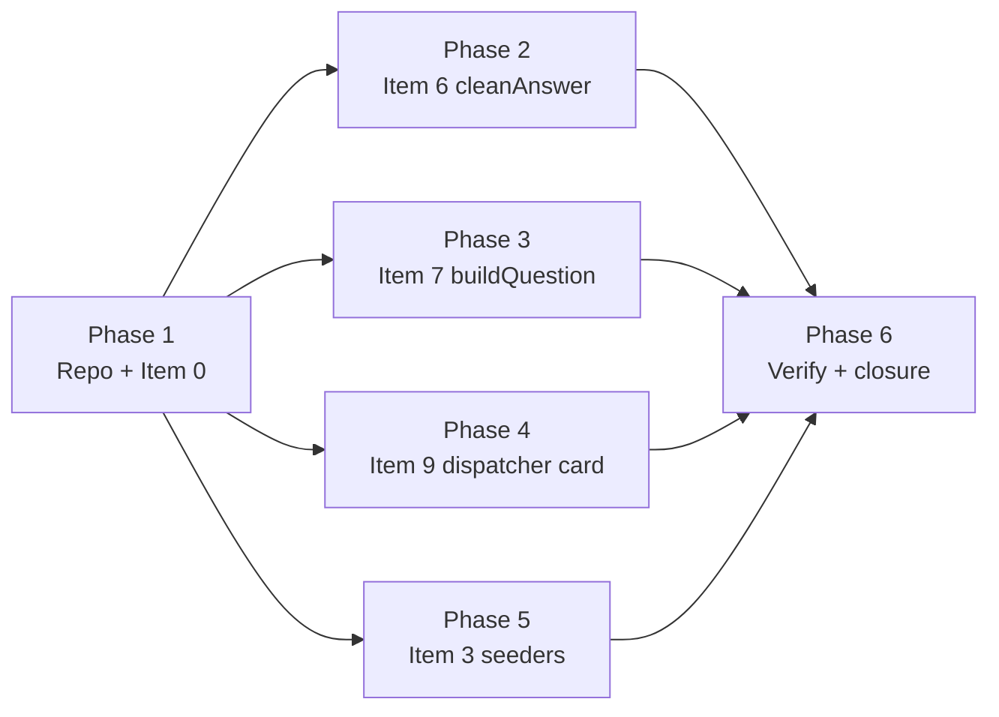

# Langfens — Sprint 5 Plan

> Companion to `HANDOFF_SPRINT5.md`. Same Sprint 5 scope (4 Group D items + Item 0), deeper per-item design — exact file paths, exact test scenarios, exact decisions. Read HANDOFF first, PLAN second.
> **Review Note:** Technical review conducted in `docs/sprint5/REVIEW.md` (verdict: **APPROVE-WITH-FIXES**). All 10 review findings (DEF-01 through DEF-10) and §4 actionable corrections have been incorporated into this plan.

---

## §1 — Scope & Non-Goals

In-scope items (numbering matches HANDOFF_SPRINT5.md §2):

### Item 0 — `/docs/` policy decision (Phase 1)

- **Non-goal:** Force any specific policy. Item 0 produces a recorded decision, not a unilateral change.
- **Acceptance:** Parent picks one of options 1/2/3 (HANDOFF §2 Item 0). Whichever option chosen lands its commit in Phase 1.

### Item 3 — UUID seeder cleanup (Phase 5, last)

- **Trigger:** Inline `Guid.Parse("33333333-…")` literals are unreadable and re-seed runs after code edits silently re-introduce them. Three seeder files contain 19 + 24 + 17 = **60** total `Guid.Parse(` calls; 47 of those are question IDs with the `XXX…XXX-N` test pattern.
- **Approach (deterministic GUID helper):**
  Instead of non-deterministic `Guid.NewGuid()` or `Random(DateTime.UtcNow.Ticks)`, use a deterministic GUID generation helper `SeederHelpers.CreateDeterministicGuid(slug, idx)` (e.g. namespace UUIDv5/MD5 hash or static deterministic mapping table):
  ```csharp
  // exam-service/Data/SeederHelpers.cs
  public static class SeederHelpers
  {
      public static Guid CreateDeterministicGuid(string examSlug, int questionIdx)
      {
          using var md5 = System.Security.Cryptography.MD5.Create();
          var input = System.Text.Encoding.UTF8.GetBytes($"{examSlug}:question:{questionIdx}");
          var hash = md5.ComputeHash(input);
          return new Guid(hash);
      }
  }
  ```
  Per-file, generate or map deterministic IDs into `var qIds = new Dictionary<int, Guid>();` and replace question-ID `Guid.Parse(...)` calls with `var qNId = qIds[N];` (or pre-defined deterministic constants).
  **Non-question IDs (DEF-08):** Exam and Section IDs (e.g., ~4 in `ReadingSeeder.cs`, ~5 in `ListeningSeeder.cs`, ~4 in `GeneratedReadingSeeder.cs`) remain literal `Guid.Parse` calls because they do not carry question-style ordinals or question FK risk.
- **Acceptance (observable):**
  - `grep -c 'Guid\.Parse(' services/exam-service/Data/ReadingSeeder.cs` returns the expected post-cleanup count (~4, only Exam/Section IDs remain; question-ID literals = 0).
  - `grep -c 'Guid\.Parse(' services/exam-service/Data/ListeningSeeder.cs` returns expected post-cleanup count (~5 remaining for exam/section/passage IDs).
  - `grep -c 'Guid\.Parse(' services/exam-service/Data/GeneratedReadingSeeder.cs` returns expected post-cleanup count (~4 remaining for exam/section IDs).
  - `dotnet build services/exam-service/services/exam-service.csproj` exits 0.
  - Live `exam-db` row count for `ielts-reading-practice-1` Section 1 (5 rows) unchanged.
- **Test coverage plan (DEF-04):** Determinism test added to existing `services/attempt-service.Tests/Seeders/ReadingSeederDeterminismTests.cs` (DEF-04 fix: `services/attempt-service.Tests/` exists and references exam entities; `services/exam-service.Tests/` does not exist). Scenarios:
  - Re-invoke `ReadingSeeder.Seed(...)` twice; assert `Exam.Id`, every `Section.Id`, every `Question.Id` are byte-identical between runs.
  - Same for `ListeningSeeder`, parameterized over one fixture case.
  - Assert question IDs do NOT contain the legacy `33333333-…`/`55555555-…`/`43333333-…` literal strings after replacement.
- **Migration / backfill protocol (JSON sidecar staged via standalone script/tool, NOT inline seeder I/O — DEF-10):**
  1. **Generate.** Standalone script or staging utility (`scripts/generate_legacy_uuid_map.py` or a dedicated test harness tool) emits the legacy → deterministic new UUID pair list as JSON to `services/exam-service/Migrations/<slug>_legacy_uuid_map.json`. Seeder classes themselves do NOT perform throwaway file I/O in production code.
  2. **Aggregate.** `scripts/migrate_blank_placeholders.py` gains a `--aggregate-uuid-maps` flag that aggregates `*_legacy_uuid_map.json` into `services/exam-service/Migrations/seed_legacy_uuid_map.json`.
  3. **Stage (no execute).** Sprint 5 Phase 5 commits the JSON sidecar artifact but does NOT add the `--apply-uuid-map` runtime step. The FK remap is staged but inert.
  4. **Acceptance for Sprint 5:** `services/exam-service/Migrations/seed_legacy_uuid_map.json` exists, parses as valid JSON, contains ≥ 47 entries, and `python3 scripts/migrate_blank_placeholders.py --dry-run --apply-uuid-map` exits 0 with `updated_rows: 0` (live DB untouched) and `orphan_rows: 0`.
### Item 6 — DRY `cleanAnswer` helper (Phase 2, first refactor)

- **Trigger:** Two divergent regex chains. Canonical at `langfens-fe-app/src/app/attempts/[attemptId]/utils.ts:66-94` collapses whitespace and dedupes slashes. Inlined at `langfens-fe-app/src/app/do-test/[skill]/[attemptId]/components/common/QuestionPanel.tsx:111` does neither. Question-panel submission may diverge from review-page rendering.
- **Approach (canonical union implementation preserving G15 and case):**
  ```typescript
  // langfens-fe-app/src/lib/cleanAnswer.ts

  /**
   * Consolidates canonical answer cleaning logic from:
   * - src/app/attempts/[attemptId]/utils.ts:66-94
   * - src/app/do-test/[skill]/[attemptId]/components/common/QuestionPanel.tsx:111-130
   *
   * Preserves G15 invariant: explicitly named administrative prefixes are stripped,
   * but legitimate user answer prefixes (e.g. "Reason: ...", "Title: ...") remain intact.
   * Case is PRESERVED (no forced toLowerCase).
   */
  export function cleanAnswer(s: string | undefined | null): string {
    if (!s) return "";

    let clean = String(s)
      .replace(/\\n/g, "\n")
      .replace(/blank[-_]\w+:\s*/gi, "")
      .replace(/\[blank[-_]\w+\]/gi, "")
      .replace(/label[-_ ]*\w*:\s*/gi, "")
      .replace(/step[-_ ]*\w*:\s*/gi, "")
      .replace(/node[-_ ]*\w*:\s*/gi, "")
      .replace(
        /^\s*(?:paragraph|info|step|flow|node|part|section)?[-_ ]*\w*:\s*/i,
        ""
      )
      .replace(/\b(?:paragraph|info)[-_ ]*\w*:\s*/gi, "")
      .replace(/^feature[-_]?q?\d*:\s*/i, "")
      .replace(/^q\d+:\s*/i, "")
      .replace(
        /^(heading|item|answer|key|option|part|section|paragraph|info|flow)[-_]?\d*:\s*/gi,
        ""
      )
      .replace(/\s+/g, " ")
      .trim();

    // Deduplicate identical slash tokens e.g. "D / D" -> "D" or "True/True" -> "True"
    if (/^([A-Za-z0-9]+)\s*\/\s*\1$/i.test(clean)) {
      clean = clean.split("/")[0].trim();
    } else if (clean.includes(" / ")) {
      clean = clean.split(" / ")[0].trim();
    }

    return clean;
  }
  ```
  Both call sites become `import { cleanAnswer } from '@/lib/cleanAnswer';`. `utils.ts` re-exports `cleanAnswer` for back-compat with any indirect importer.
- **Acceptance (observable):**
  - `src/lib/cleanAnswer.ts` exists with the documented signature.
  - `utils.ts:66-94` no longer holds the inline regex body (line count drops by ~28).
  - `QuestionPanel.tsx:111` imports `cleanAnswer` (no inline `.replace(...)` chain at that line).
  - `npx vitest run src/app/attempts/_components/__tests__/ResultV3Review.parseUserAnswer.test.ts` exits 0.
  - `npx tsc --noEmit` exits 0.
- **Test coverage plan:** `src/lib/__tests__/cleanAnswer.test.ts` (vitest). Scenarios:
  - `undefined` input → `''`
  - empty string input → `''`
  - whitespace collapse: `'  hello   world  '` → `'hello world'`
  - slash dedup: `'D / D'` → `'D'`, `'cat/cat'` → `'cat'`, `'A / B'` → `'A'`
  - prefix stripping: `'blank_1: answer'` → `'answer'`, `'[blank_2] foo'` → `'foo'`, `'heading-1: Bar'` → `'Bar'`
  - G15 invariant: `'Reason: important factor'` → `'Reason: important factor'` (intentional user prefix preserved)
  - case preservation: `'VII'` → `'VII'`, `'True'` → `'True'` (case is NOT lowercased)

### Item 7 — DRY `buildQuestion` helper (Phase 3)

- **Approach (helper signature & imports — DEF-05, DEF-06):**
  Do NOT move `deriveUiKind` or `isWordListBlank` into `src/lib/buildQuestion.ts`. They already live canonically in `src/lib/deriveUiKind.ts` and are imported across the codebase. `buildQuestion.ts` simply imports them and uses `import type { Question as UiQuestion } from "@/types/question.type"`.
  ```typescript
  // langfens-fe-app/src/lib/buildQuestion.ts
  import { deriveUiKind, isWordListBlank } from "@/lib/deriveUiKind";
  import type { Question as UiQuestion } from "@/types/question.type";

  export function buildQuestion(q: any): UiQuestion {
    const uiKind =
      q.type === "MATCHING_INFORMATION"
        ? isWordListBlank(q.promptMd ?? "")
          ? "matching_information"
          : "matching_paragraph"
        : deriveUiKind(q.type);

    const base: UiQuestion = {
      id: q.id,
      idx: q.idx,
      stem: q.promptMd,
      backendType: q.type,
      uiKind,
      explanationMd: q.explanationMd,
      imageUrl: q.imageUrl ?? null,
      modelAnswers: q.modelAnswers ?? null,
      wordList: q.wordList ?? null,
      groupId: q.groupId ?? null,
    };

    if (uiKind === "forice_single" || uiKind === "forice_multiple") {
      return {
        ...base,
        forices: (q.options ?? []).map((opt: any) => ({
          value: opt.id,
          label: String(opt.contentMd).replace(/^[A-Z]\.\s+/, ""),
        })),
      };
    }

    if (uiKind === "flow_chart") {
      return { ...base, flowChartNodes: q.flowChartNodes ?? [] };
    }

    if (uiKind === "matching_heading" && q.options?.length) {
      return {
        ...base,
        forices: q.options.map((opt: any) => ({
          value: String(opt.contentMd).split(".")[0].trim(),
          label: opt.contentMd,
        })),
      };
    }

    return base;
  }
  ```
  Both pages replace the local 47-line block with `import { buildQuestion } from '@/lib/buildQuestion';` and a 1-line call.
- **Acceptance (observable):**
  - `src/lib/buildQuestion.ts` exists and imports `deriveUiKind` / `isWordListBlank` from `@/lib/deriveUiKind`.
  - `src/lib/deriveUiKind.ts` is NOT modified or duplicated.
  - Do-test page line range 50-96 is replaced by the import + 1 call (< 5 lines).
  - Placement page line range 56-102 is replaced identically.
  - `npx vitest run src/lib/__tests__/buildQuestion.test.ts` exits 0.
  - Visual inspection of do-test/placement with a 5-question fixture shows byte-identical question lists before/after.
- **Test coverage plan:** `src/lib/__tests__/buildQuestion.test.ts` (vitest). Scenarios:
  - Reading fixture: `Reading` exam with `MULTIPLE_CHOICE_SINGLE` + `SENTENCE_COMPLETION` questions; assert `UiQuestion` shape matches expected.
  - Listening fixture: `Listening` exam with `MAP_LABEL` + `MATCHING` questions; assert kind derivation correct.
  - Placement fixture: cover each Kind variant (`Reading`, `Listening`, `Writing`) at least once.
  - Edge case: question with `BlankAcceptTexts` round-trips unchanged.
### Item 9 — G11 dispatcher fallback card (Phase 4)

- **Trigger:** Silent fallback path in `langfens-fe-app/src/app/do-test/[skill]/[attemptId]/components/common/QuestionPanel.tsx`. When `QuestionComponentRegistry[q.backendType]` returns `undefined`, `questionContent` stays `null` — invisible UI, no `console.warn`. End-user debugging requires DevTools.
- **Approach (card + dispatcher wiring in QuestionPanel.tsx — DEF-07):**
  Component placed at `langfens-fe-app/src/app/do-test/[skill]/[attemptId]/_components/cards/UnsupportedQuestionCard.tsx`:
  ```tsx
  import React from "react";

  export function UnsupportedQuestionCard({ backendType }: { backendType: string }) {
    return (
      <div className="rounded-lg border border-amber-300 bg-amber-50 p-4 my-2 text-amber-900">
        <div className="flex items-center gap-2 font-semibold">
          <span className="material-symbols-rounded text-amber-600">warning</span>
          <span>Unsupported question type: {backendType}</span>
        </div>
        <p className="mt-1 text-sm text-amber-700">
          This question format is not supported by the test runner yet.
        </p>
      </div>
    );
  }
  ```
  In `QuestionPanel.tsx` (the true dispatcher site), wire `UnsupportedQuestionCard` directly with a throttled `seenWarnTypes` set to prevent log spam:
  ```tsx
  // In QuestionPanel.tsx
  import { UnsupportedQuestionCard } from "../../_components/cards/UnsupportedQuestionCard";

  const seenWarnTypes = new Set<string>();

  // Inside render loop:
  const TargetComponent = QuestionComponentRegistry[q.backendType];
  if (uiKind === "matching_paragraph") {
    // ... inline paragraph input ...
  } else if (TargetComponent) {
    // ... existing TargetComponent branching ...
  } else {
    // G11 Fallback
    if (!seenWarnTypes.has(q.backendType)) {
      console.warn(`[QuestionPanel] No card component registered for backendType="${q.backendType}"`);
      seenWarnTypes.add(q.backendType);
    }
    questionContent = <UnsupportedQuestionCard backendType={q.backendType} />;
  }
  ```
  In `QuestionComponentRegistry.tsx`, optionally export `FALLBACK = UnsupportedQuestionCard` for reference.
- **Acceptance (observable):**
  - `_components/cards/UnsupportedQuestionCard.tsx` exists with amber warning styling and takes `{ backendType: string }`.
  - `QuestionPanel.tsx` dispatches to `UnsupportedQuestionCard` when no registered component matches `q.backendType`.
  - `console.warn` triggers exactly once per unique unmapped `backendType`.
  - `npx vitest run …/__tests__/UnsupportedQuestionCard.test.tsx` exits 0 with 3+ assertions.
  - Manual smoke: load do-test page with an unmapped `backendType` → visible amber card with type label; DevTools shows exactly one `[QuestionPanel]` warning.
- **Test coverage plan:** `_components/cards/__tests__/UnsupportedQuestionCard.test.tsx` (vitest + happy-dom). Scenarios:
  - Renders `Unsupported question type: FOO_BAR` for `backendType="FOO_BAR"`.
  - Renders warning icon and explanatory subtitle.
  - `console.warn` fires exactly once per unique `backendType` across 5 re-renders of the same fixture (`vi.spyOn(console, 'warn')` call count = 1).
### Out of scope

- C1-C6 Group C bugs (HALLUCINATED, already closed in Sprint 4).
- New question types or grader registrations.
- Gateway YARP routing changes.
- Aspire AppHost resource additions.
- AI-service model/prompt changes.
- DB migrations (no schema change).

---

## §2 — Key Decisions & Rationale

### (a) Helper file location `langfens-fe-app/src/lib/`

Items 6 and 7 both extract into `langfens-fe-app/src/lib/`, not co-located with the cards or the pages.
- **Why shared (`src/lib/`):** Both helpers are imported by multiple unrelated surfaces (do-test `QuestionPanel.tsx` + attempts `utils.ts` for `cleanAnswer`; do-test `page.tsx` + placement `page.tsx` for `buildQuestion`). Putting them under feature folders would create odd cross-feature imports.
- **Why not `components/common/`:** Folder precedent (Sprint 4) is for presentational components only; helpers are pure functions and mixing them in causes circular-import risk once `QuestionComponentRegistry.tsx` later needs `cleanAnswer` (Phase 4 will not, but Phase 5 migrations might).
- **Why a top-level `src/lib/__tests__/`:** Vitest discovers tests via the existing `**/*.{test,spec}.{ts,tsx}` glob (`vitest.config.ts`). Co-locating tests next to source (`cleanAnswer.ts` + `cleanAnswer.test.ts` in one folder) is also acceptable — Sprint 4 used co-location (`CompletionCard.sort.test.tsx`); Sprint 5 mirrors the precedent for `src/lib/` by placing tests in a sibling `__tests__/` folder to keep `src/lib/` clean.

### (b) Seeder UUID generation strategy

Three options considered for deterministic GUID values keyed by Idx:
- **(i) Deterministic MD5/SHA1 UUIDv5 hash of examSlug + questionIdx (Selected - DEF-03):** Compute `MD5($"{examSlug}:question:{idx}")` to generate deterministic, byte-identical GUIDs across every process invocation. Pure function, zero state, guarantees reproducibility across all test and dev runs.
- **(ii) Static pre-generated constant GUID dictionary:** Define a static dictionary mapping `idx` to pre-calculated GUIDs. Guarantees byte-identical outputs, but requires hardcoding per exam.
- **(iii) Timestamp-pinned PRNG (Rejected):** `Random(DateTime.UtcNow.Ticks)` or `Guid.NewGuid()`. Strictly non-deterministic; produces random IDs on every run and corrupts FK references across restarts.

**Decision: option (i)** — Deterministic hash helper `SeederHelpers.CreateDeterministicGuid(slug, idx)`.

Implementation helper:
```csharp
public static class SeederHelpers
{
    public static Guid CreateDeterministicGuid(string examSlug, int questionIdx)
    {
        using var md5 = System.Security.Cryptography.MD5.Create();
        var input = System.Text.Encoding.UTF8.GetBytes($"{examSlug}:question:{questionIdx}");
        var hash = md5.ComputeHash(input);
        return new Guid(hash);
    }
}
```
The xUnit determinism test in `services/attempt-service.Tests/Seeders/` asserts that running `CreateDeterministicGuid` or calling seed methods produces identical GUIDs across consecutive invocations.

### (c) cleanAnswer canonical regex = true union preserving case and G15

The two sites differ in regex chains, prefix coverage, and whitespace handling:

| Site | Prefix stripping | Whitespace collapse | Slash handling | Case preservation |
|------|------------------|---------------------|----------------|-------------------|
| `utils.ts:66-94` | Full regex chain (`blank[-_]`, `\[blank\]`, `label`, `paragraph|info|step|flow|node|part|section`, etc.) | Yes (`/\s+/g` → `' '`) | `D/D` token dedup (`/^([A-Za-z0-9]+)\/\1$/i`) | **Preserves case** (does NOT call `.toLowerCase()`) |
| `QuestionPanel.tsx:111-130` | `blank`, `label`, `step`, `node`, `feature`, `q\d+`, `(heading|item|answer|key|option|part|section|paragraph|info|flow)` | No | `D / D` split on `" / "` | **Preserves case** |

**Decision: true union preserving original case.**
1. **Preserve case:** Neither existing site calls `.toLowerCase()`. Forcing lowercase would corrupt Roman numerals (`"VII"` → `"vii"`), acronyms, and proper nouns in headings. Original case MUST be preserved.
2. **Retain prefix stripping:** Retain the full set of prefix-stripping regexes from both files (`blank[-_]`, `label[-_]`, `step[-_]`, `node[-_]`, `feature[-_]`, `q\d+`, `heading|item|answer|key|option|part|section|paragraph|info|flow`).
3. **Preserve G15 invariant:** Do NOT use generic word prefixes (`/^[\w-]+:\s*/`). Only explicitly known administrative prefixes are stripped. Legitimate user answers like `"Reason: important factor"` or `"Title: Introduction"` remain intact.
4. **Whitespace & slashes:** Collapse whitespace (`/\s+/g` → `' '`) and handle slash tokens (`D/D` → `D`, `D / D` → `D`, `A / B` → `A`).

### (d) Test file location — co-located vs `__tests__/` folder

Two patterns coexist already:
- Sprint 4 precedent (`CompletionCard.sort.test.tsx`): **co-located** under `_components/cards/__tests__/`. The folder name `__tests__` is the conventional vitest+react convention.
- Project-root precedent (`ResultV3Review.parseUserAnswer.test.ts`): **co-located** under the parent feature folder's `_components/__tests__/`.

**Decision: co-located under `__tests__/`** for all Sprint 5 new specs. Rationale:
- Vitest's existing glob `**/*.{test,spec}.{ts,tsx}` already discovers both layouts.
- Co-location groups spec + impl so a future reader sees both at once.
- Sprint 4 already co-locates; deviating in Sprint 5 creates an ad-hoc split.

Apply to: `src/lib/__tests__/cleanAnswer.test.ts`, `src/lib/__tests__/buildQuestion.test.ts`, `…/_components/cards/__tests__/UnsupportedQuestionCard.test.tsx`.
Apply to .NET: `services/attempt-service.Tests/Seeders/ReadingSeederDeterminismTests.cs` (DEF-04 fix).

### Commit History (expected sequence)

| Order | Commit message | Item |
|-------|----------------|------|
| 1 | `chore(docs): apply sprint5 /docs/ policy` | Item 0 (Phase 1) |
| 2 | `chore(scripts): commit MCQ-scan extension` (resolves Sprint 4 carryover) | Risk (e) |
| 3 | `refactor(fe): consolidate cleanAnswer into src/lib/cleanAnswer` | Item 6 (Phase 2) |
| 4 | `refactor(fe): extract buildQuestion helper into src/lib` | Item 7 (Phase 3) |
| 5 | `feat(fe): add UnsupportedQuestionCard for G11 dispatcher fallback` | Item 9 (Phase 4) |
| 6 | `chore(seeders): replace GUID literals with deterministic dictionary lookup` | Item 3 (Phase 5) |
| 7 | `chore(seeder-uuid): aggregate legacy uuid map + stage remap script` | Item 3 (Phase 5, migration artifact) |
| 8 | `docs(handoff): close Sprint 5 with §6 closure summary` | Phase 6 |

Commits 1-2 are interchangeable (both Phase 1 prerequisites). Commits 3-5 are sequential (Item 6 → 7 → 9 per Phase ordering). Commit 6 lands after 3-5 because Item 3 has FK risk. Commit 7 is a follow-up to commit 6 (same Phase 5). Commit 8 closes sprint.

---

## §3 — Dependency Graph



**Ordering rationale:**
- Phase 2 (Item 6) FIRST among FE refactors: it touches `QuestionPanel.tsx`, which the do-test page imports. If Phase 3 (Item 7) extracted `buildQuestion` first and renamed `QuestionPanel.tsx` calls along the way, Phase 2's diff would be muddied.
- Phase 3 (Item 7) SECOND: same registry surface (`src/lib/`) as Phase 2, sequential commits minimize churn in `import` statements.
- Phase 4 (Item 9) THIRD: dispatcher card sits in `_components/cards/` (a different folder from `src/lib/`), so it's isolated from Phases 2-3 and could run in parallel, but the `console.warn` semantics can interact with future Sprint 6 instrumentation — testing it after Phases 2-3 stabilizes the warnings surface.
- Phase 5 (Item 3) LAST: touches live `attempt_answer.QuestionId` references. By the time it runs, Phases 2-4 are merged, vitest coverage is in place, and any FK surface regression from Phase 5 is clearly attributable (no concurrent refactors).
- Phase 6 (verification + handoff closure) AFTER all 4 phases.

**Explicit non-dependencies:** Items 6, 7, 9 do not depend on each other modulo import paths. Item 3 has zero FE overlap and can land after Items 6/7/9 in any order.

---

## §4 — Phase Breakdown

### Phase 1 — Repo setup + Item 0 (/docs/ policy)

| Aspect | Detail |
|---|---|
| Files touched | `.gitignore` (BE + FE) only if option 2 chosen; otherwise no code |
| Tests | none (policy choice, not behavior) |
| Verification | `git check-ignore docs/sprint5/PLAN.md docs/sprint4/PLAN.md` confirms policy applied; option 1 = `git add -f ...` then `git ls-files docs/` shows tracked entries |
| Commit message | `chore(docs): apply sprint5 /docs/ policy` |

### Phase 2 — Item 6 (DRY cleanAnswer, lowest risk)

| Aspect | Detail |
|---|---|
| Files touched | `src/lib/cleanAnswer.ts` (new); `src/app/attempts/[attemptId]/utils.ts`; `src/app/do-test/[skill]/[attemptId]/components/common/QuestionPanel.tsx` |
| Tests | `src/lib/__tests__/cleanAnswer.test.ts` (new, 6 cases per §1); existing `ResultV3Review.parseUserAnswer.test.ts` extends by ≥ 1 case |
| Verification | `npx vitest run src/lib/__tests__/cleanAnswer.test.ts src/app/attempts/_components/__tests__/ResultV3Review.parseUserAnswer.test.ts` exits 0; `npx tsc --noEmit` exits 0 |
| Commit message | `refactor(fe): consolidate cleanAnswer into src/lib/cleanAnswer` |

### Phase 3 — Item 7 (DRY buildQuestion)

| Aspect | Detail |
|---|---|
| Files touched | `src/lib/buildQuestion.ts` (new); `src/app/do-test/[skill]/[attemptId]/page.tsx` (lines 50-96); `src/app/placement/[attemptId]/page.tsx` (lines 56-102) |
| Tests | `src/lib/__tests__/buildQuestion.test.ts` (new, ≥ 4 cases per §1) |
| Verification | `npx vitest run src/lib/__tests__/buildQuestion.test.ts` exits 0; line-count drop on both pages (47 → ~5 per file); `npx tsc --noEmit` exits 0 |
| Commit message | `refactor(fe): extract buildQuestion helper into src/lib` |

### Phase 4 — Item 9 (G11 dispatcher card)

| Aspect | Detail |
|---|---|
| Files touched | `_components/cards/UnsupportedQuestionCard.tsx` (new); `components/common/QuestionPanel.tsx` (dispatcher wiring + throttled `console.warn`); `components/QuestionComponentRegistry.tsx` (`FALLBACK` export) |
| Tests | `_components/cards/__tests__/UnsupportedQuestionCard.test.tsx` (new, 3 cases per §1) |
| Verification | `npx vitest run …/__tests__/UnsupportedQuestionCard.test.tsx` exits 0; manual smoke with unmapped fixture renders visible amber card; `npx tsc --noEmit` exits 0 |
| Commit message | `feat(fe): add UnsupportedQuestionCard for G11 dispatcher fallback` |

### Phase 5 — Item 3 (UUID seeders, FK risk)

| Aspect | Detail |
|---|---|
| Files touched | `services/exam-service/Data/{Reading,Listening,GeneratedReading}Seeder.cs`; `services/exam-service/Data/SeederHelpers.cs` (new deterministic GUID helper); `scripts/migrate_blank_placeholders.py`; `services/attempt-service.Tests/Seeders/ReadingSeederDeterminismTests.cs` (new) |
| Tests | xUnit determinism test in `attempt-service.Tests/Seeders/ReadingSeederDeterminismTests.cs`; pre-/post-`exam-db` row count assertion in `VERIFICATION_2026-09-XX.md` (Phase 6 verification artifact) |
| Verification | `grep -c 'Guid\.Parse('` reports ~4 for Reading, ~5 for Listening, ~4 for GeneratedReading (question-ID literals eliminated, Exam/Section IDs remain); `dotnet build services/exam-service/services/exam-service.csproj` exits 0; `dotnet test services/attempt-service.Tests` exits 0 across 2 consecutive invocations; live `exam-db` row count for `ielts-reading-practice-1` Section 1 = 5 (unchanged); `attempt_answer` orphan count for that section = 0 |
| Commit message | `chore(seeders): replace GUID literals with deterministic dictionary lookup` |
### Phase 6 — Verification + handoff closure

| Aspect | Detail |
|---|---|
| Files touched | `HANDOFF_SPRINT5.md` (this file's parent, update §6 with closure summary); `docs/sprint5/VERIFICATION_YYYY-MM-DD.md` (new, parity with Sprint 4 `VERIFICATION_2026-09-11.md`) |
| Tests | final solution-wide sanity: `dotnet build Project_Langfens_Microservice.sln`, `npx tsc --noEmit`, `npx vitest run` |
| Verification | all HANDOFF §7 criteria green; chosen `/docs/` policy recorded; 4 commit SHAs recorded |
| Commit message | `docs(handoff): close Sprint 5 with §6 closure summary` |

---

## §5 — Risks & Mitigations

| Risk | Likelihood | Impact | Mitigation | Owner |
|------|------------|--------|------------|-------|
| (a) Item 3 PK churn breaks `attempt_answer.QuestionId` FK refs | Med | High | Capture pre-/post-row counts; emit `Dictionary<Guid, Guid>` in `scripts/migrate_blank_placeholders.py`; do NOT re-seed live DB during Sprint 5 | Parent |
| (b) Item 6 signature change breaks `ResultV3Review.parseUserAnswer.test.ts` | Low | Med | Signature `(s: string \| undefined) => string` is a strict superset; vitest re-run before commit | Phase 2 |
| (c) Item 9 needs visible card + log fallback simultaneously | Med | Low | New vitest spec explicitly verifies `console.warn` count = 1 per unique type using `vi.spyOn`; in-memory `Set<string>` gate | Phase 4 |
| (d) `/docs/` policy debt (8 untracked Sprint 4 docs + new Sprint 5 docs) | High | Low | Item 0 forces Phase 1 decision; recorded in HANDOFF §6 | Parent |
| (e) BE working-tree carryover `scripts/migrate_blank_placeholders.py` collides with Phase 5 changes | Med | Med | Commit or stash before Phase 5 starts | Phase 1 |
| (f) `dotnet build Project_Langfens_Microservice.sln` mid-Sprint 5 introduces phantom failures from concurrent unrelated edits | Med | Low | Coop-rule: only Phase 6 runs solution-wide build; in-phase verification uses scoped `dotnet build <service>.csproj` | All implementers |
| (g) Item 7 local helpers `isWordListBlank`/`deriveUiKind` are referenced outside `page.tsx` blocks | Low | Med | Audit by grep before Phase 3 merge; if referenced elsewhere, those callers also import from `src/lib/buildQuestion.ts` | Phase 3 |
| (h) Vitest tests on FE (`npx vitest run`) report flaky `console.warn` ordering in Item 9 spec | Low | Low | Use `vi.spyOn` and assert exact call count; reset spies between tests | Phase 4 |

---

## §6 — Sprint 5 Closure Checklist

Mapping back to `HANDOFF_SPRINT5.md` §7 acceptance criteria:

- [ ] **#1 Item 0 policy** selected and committed (option 1, 2, or 3 recorded).
- [ ] **#2 Item 3** — seeder question-ID `Guid.Parse(` calls replaced with deterministic GUIDs (Section/Exam IDs remain literal); determinism test green; live DB rows unchanged.
- [ ] **#3 Item 6** — `src/lib/cleanAnswer.ts` exists and is the single source; both call sites import it; existing `parseUserAnswer` test still green.
- [ ] **#4 Item 7** — `src/lib/buildQuestion.ts` exists and is the single source; both pages import it.
- [ ] **#5 Item 9** — `UnsupportedQuestionCard.tsx` exists; `FALLBACK` exported; new spec covers 3 cases including log-once.
- [ ] **#6 Vitest counts** ≥ 9 baseline + ≥ 11 Sprint 5 additions = ≥ 20 total.
- [ ] **#7 Solution build** exits 0.
- [ ] **#8 TypeScript check** exits 0.
- [ ] **#9 No FK breakage** — pre-/post-snapshot of `attempt_answer` orphan count = 0.
- [ ] **#10 Handoff closure** — `HANDOFF_SPRINT5.md` §6 + this PLAN.md §6 both signed off.
- [ ] **#11 Carryover resolved** — `scripts/migrate_blank_placeholders.py` committed.

---

## §7 — Acceptance Criteria (Definition of Done for Sprint 5)

Sprint 5 is DONE when ALL of the following are observably true:

1. `git ls-files docs/sprint5/` returns both files (`PLAN.md`, plus `REVIEW.md` if Phase 6 produced one — see HANDOFF §4) — assuming Item 0 = option 1 or 2. If option 3, equivalent per-service paths are tracked instead.
2. `grep -c 'Guid\.Parse('` in `services/exam-service/Data/{Reading,Listening,GeneratedReading}Seeder.cs` matches expected section/exam ID counts (~4 in Reading, ~5 in Listening, ~4 in GeneratedReading); all question-ID literals are eliminated in favor of deterministic helper.
3. `cat src/lib/cleanAnswer.ts | head -1` returns `export function cleanAnswer(`. `grep -r 'from "@/lib/cleanAnswer"' src/app/do-test src/app/attempts` returns ≥ 2 hit lines.
4. `cat src/lib/buildQuestion.ts | head -1` returns `import type {`. `grep -r 'from "@/lib/buildQuestion"' src/app/do-test src/app/placement` returns ≥ 2 hit lines.
5. `cat src/app/do-test/\[skill\]/\[attemptId\]/_components/cards/UnsupportedQuestionCard.tsx | grep -c 'Unsupported question type'` returns ≥ 1.
6. `cd langfens-fe-app && npx vitest run 2>&1 | tail -5` shows **0 failed** and a total test count ≥ 20.
7. `cd Project_Langfens_Microservice && dotnet build Project_Langfens_Microservice.sln 2>&1 | tail -3` shows `0 Error(s)`.
8. `cd langfens-fe-app && npx tsc --noEmit 2>&1 | tail -3` shows `0 errors`.
9. Live `exam-db` row count for `ielts-reading-practice-1` Section 1 (`docker exec exam-db-server-… psql -c "SELECT COUNT(*) FROM exam_questions q JOIN exam_sections s ON s.\"Id\" = q.\"SectionId\" JOIN exams e ON e.\"Id\" = s.\"ExamId\" WHERE e.\"Slug\" = 'ielts-reading-practice-1' AND s.\"Idx\" = 0;"`) = 5, pre and post.
10. `HANDOFF_SPRINT5.md` §6 closure summary populated with: chosen policy, 4 commit SHAs, final test count.

---

*End of PLAN.md. See HANDOFF_SPRINT5.md for executive summary.*
